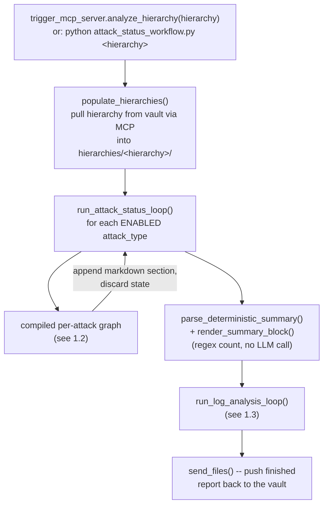
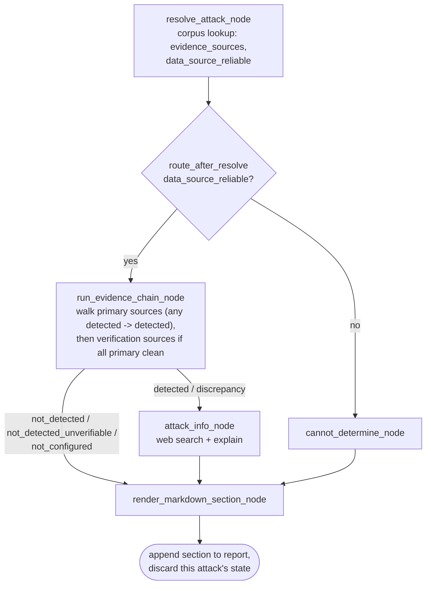
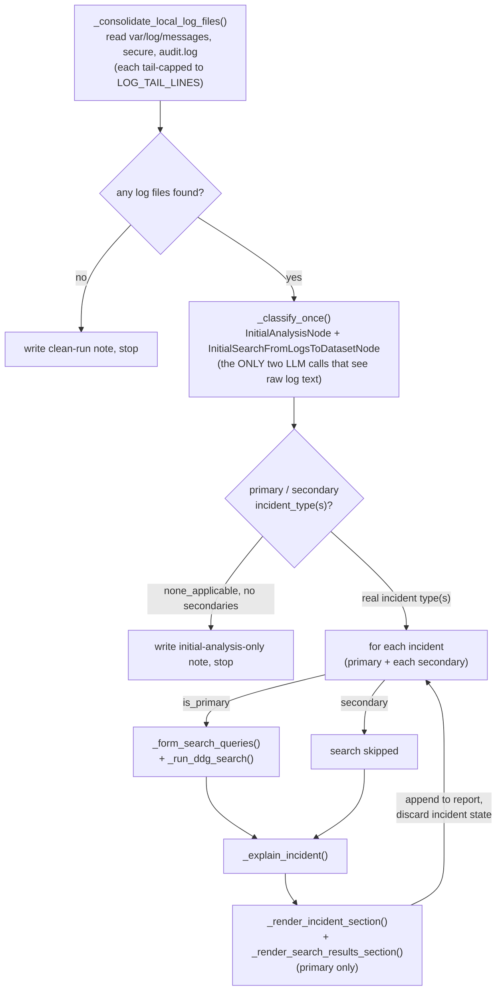

# Cybersecurity Log Analysis Agent — Technical Documentation

This document is the technical reference for the LangGraph-based analysis
pipeline: its architecture, how to install and run it, what each moving
part is for, and — attack type by attack type — exactly what each step of
the pipeline checks and which code does it. For the high-level two-machine
split (vault vs. analysis) and day-to-day setup, see [README.md](README.md);
this document goes one level deeper into the analysis pipeline itself.

---

## 1. Architecture

### 1.1 Top-level flow

One run processes one hierarchy path (e.g. `5/101/1/4/1`) end to end:
pull that hierarchy's files from the vault, run every enabled attack-type
check, run the secure/messages/audit.log catch-all, write one combined
markdown report, push it back to the vault.



The top-level driver, in `analysis_system/attack_status_workflow.py`:

```python
def run_full_workflow(
    hierarchy: str,
    vault_root: str = DEFAULT_VAULT_ROOT,
    hierarchies_dir: Path = DEFAULT_HIERARCHIES_DIR,
    sync_with_vault: bool = True,
) -> dict:
    hierarchy_clean = hierarchy.strip("/\\")

    # Pull this hierarchy's vault data down to a local working copy via MCP.
    # sync_with_vault=False skips this (and the push-back at the end) for
    # local testing against a filesystem path that's already local.
    if sync_with_vault:
        print(f"Pulling {vault_root}/{hierarchy_clean} -> {hierarchies_dir / hierarchy_clean} ...")
        populate_hierarchies(vault_root, hierarchies_dir, hierarchy_clean)

    reports_dir = hierarchies_dir / hierarchy_clean / "reports"
    reports_dir.mkdir(parents=True, exist_ok=True)
    report_path = reports_dir / f"attack_status_report_{datetime.now().strftime('%Y-%m-%d_%H-%M-%S')}.md"

    local_root = str(hierarchies_dir) if sync_with_vault else vault_root
    run_attack_status_loop(hierarchy, local_root, report_path)

    summary_counts = parse_deterministic_summary(report_path)
    with open(report_path, "a", encoding="utf-8") as f:
        f.write(render_summary_block(summary_counts))

    # Catch-all: secure/messages/audit.log, appended into THIS SAME report.
    # Always runs, after the attack checks -- not opt-in.
    from lib.log_analysis_workflow import run_log_analysis_loop
    log_analysis_result = run_log_analysis_loop(hierarchy, Path(local_root), report_path)

    # Push the finished report back up to the vault, alongside the source
    # files it was generated from.
    vault_upload_result = None
    if sync_with_vault:
        vault_upload_result = send_files(
            str(report_path), "upload_file",
            relative_path=f"{hierarchy_clean}/reports/{report_path.name}",
        )
        print(f"Uploaded report to vault: {vault_upload_result}")

    return {
        "hierarchy": hierarchy,
        "report_path": str(report_path),
        "summary_counts": summary_counts,
        "log_analysis": log_analysis_result,
        "vault_upload_result": vault_upload_result,
    }
```

Both the per-attack loop and the log-analysis loop are deliberately
**context-flat**: each iteration (one attack type, or one log-derived
incident) runs as a fresh, isolated invocation, appends its own markdown
section to the same report file on disk, and then everything about that
iteration — evidence text, search results, LLM output — goes out of scope.
Nothing carries forward into the next iteration except what's already been
written to the file. This is why processing 23 attack types plus several
log incidents doesn't grow the prompt size of any single LLM call as the
run progresses.

### 1.2 Per-attack-type graph

Every attack type — `ransomware`, `user_breach`, `config_drift`, all 23 —
runs through the exact same compiled LangGraph, just parameterized by that
attack type's own corpus entry's `evidence_sources` list (see §5.5 in the
implementation, [EVIDENCE_ENGINE_DESIGN.md](EVIDENCE_ENGINE_DESIGN.md) for
the design record, [ADDING_ATTACK_TYPES.md](ADDING_ATTACK_TYPES.md) for
authoring a new one). This is the one graph diagram that applies to all of
them; §5 covers what's different per attack type.



The graph assembly itself, in `analysis_system/attack_status_workflow.py`:

```python
def build_attack_graph():
    workflow = StateGraph(AttackState)

    workflow.add_node("resolve", resolve_attack_node)
    workflow.add_node("cannot_determine", cannot_determine_node)
    workflow.add_node("run_chain", run_evidence_chain_node)
    workflow.add_node("attack_info", attack_info_node)
    workflow.add_node("render", render_markdown_section_node)

    workflow.set_entry_point("resolve")

    workflow.add_conditional_edges("resolve", route_after_resolve, {
        "cannot_determine": "cannot_determine",
        "run_chain": "run_chain",
    })

    workflow.add_conditional_edges("run_chain", route_after_chain, {
        "attack_info": "attack_info",
        "render": "render",
    })

    workflow.add_edge("attack_info", "render")
    workflow.add_edge("cannot_determine", "render")
    workflow.add_edge("render", END)

    return workflow.compile()
```

Down from 12 nodes to 4 — `run_evidence_chain_node` is one generic engine
that replaces what used to be four separate node types
(`read_live_status_node`, `verify_against_raw_evidence_node`,
`verify_against_raw_logs_node`, plus their routing functions), driven
entirely by each attack type's own corpus-declared evidence, with no
per-attack-type Python required for any of it (§5.1 covers the full
mechanism; this was a real redesign during this project — see
EVIDENCE_ENGINE_DESIGN.md for why and ADDING_ATTACK_TYPES.md for the
12 evidence shapes this now covers with zero code).

Six possible `final_status` outcomes come out of this graph:
`detected`, `discrepancy`, `not_detected`, `not_detected_unverifiable`,
`not_configured`, `cannot_determine` — see §5.1 for what each means and
which node sets it.

### 1.3 Log analysis flow

Runs once, after every attack type has been checked, reading
`var/log/{messages,secure,audit.log}` from the **same already-pulled local
copy** (no second vault fetch). Full step-by-step code in §6.



### 1.4 Input files required

**From the vault, per hierarchy** (pulled locally by
`lib/populate_hierarchies.py`, read by the attack-status graph):

| File (relative to the hierarchy root) | Used by |
|---|---|
| `Alert.xml` | The primary customer-facing status file — most attack types' tag(s) live here |
| `athinio/system/alertlog.xml` | Upstream of many `Alert.xml` tags; also the sole home of a few tags that never roll up (`lsattr_status`, `SV_Ransom_current_status`, `User_breach`/`suspicious_user_login`) |
| `athinio/system/secOpsOutput_91/94/96/105/112/128` and similar | Per-attack raw evidence/output files (rkhunter output, config-drift text scan, immutable-attribute alert lines, breach detail, unknown-binary detail, special-folder detail) |
| `athinio/system/aide_report.txt`, `athinio/system/rootkitscan.txt` | Supplementary evidence for `rootkit_malware` |
| `athinio/security/malwarefiles.xml`, `athinio/security/dataprotection.xml` | `clam_malware` / `dlp_data_exposure` counts |
| `var/neridio/banned_ip.xml` | `banned_ip_bruteforce` (presence check) |
| `athinio/system/user_emptypass_list.xml`, `athinio/system/zero_uid.xml`, `athinio/system/nouser_noowner.xml` | Weak-password / UID-0 / orphaned-file audits |
| `var/log/secure*`, `rationalVault/log/rationalclient.log*` | `user_breach`'s verification tier, and `process_anomaly`'s evidence |
| `home/athinio/data/1cloudFiler/log/gateway.log*` | `gateway_unauthorized_breakin`'s verification tier |
| `var/log/messages`, `var/log/secure`, `var/log/audit.log` | The log-analysis catch-all (§1.3), configurable via `LOG_FILE_PATHS` |

**Local to the analysis machine** (not per-hierarchy):

| File | Used by |
|---|---|
| `corpus_documents/attack_*.json` (23 files) + reference-file entries | Ingested into `corpus_db/` by `ingest_corpus.py` — every attack type's `evidence_sources` list comes from here, not a flat config file |
| `analysis_system/model/Modelfile` + `cybersecqwen.gguf` | Builds the local Ollama model (see §4.2) |
| `analysis_system/.env` | `MCP_SERVER_URL`, `LOG_FILE_PATHS`, `LOG_TAIL_LINES`, `CLASSIFICATION_VOTE_COUNT`, `ENABLED_ATTACK_TYPES`, `CORPUS_SERVER_URL` — see `.env.example` |
| `hierarchy_system/.env` | `ANALYSIS_SERVER_URL`, optional `DATA_ROOT` |

### 1.5 Brief working

1. A trigger (either `trigger_mcp_server.py`'s `analyze_hierarchy` MCP
   tool, or running `attack_status_workflow.py` directly) names a
   hierarchy path.
2. That hierarchy's files are pulled from the vault machine over MCP into
   a local working copy.
3. Every **enabled** attack type (all 23 by default, or a subset via
   `ENABLED_ATTACK_TYPES`) is checked independently: read its live
   evidence sources, decide detected/clean/unverifiable/not-configured,
   optionally verify a "clean" read against a verification tier, explain
   a "detected" or "discrepancy" result, render one markdown section,
   append it, discard.
4. A deterministic summary (a regex count over the appended sections'
   status markers) is appended.
5. The three canonical logs are read from the same local pull and
   classified once into a primary + secondary incident type(s); each gets
   its own isolated search-and-explain pass (primary only gets the web
   search) and its own appended section.
6. The finished report is pushed back to the vault next to the source
   files it was generated from.

---

## 2. Installation

Full detail (Rocky Linux 8 + Windows installers, tar packaging) is in
[README.md's Packaging and installing section](README.md#packaging-and-installing). Summary:

### 2.1 Packaged install (recommended for a real deployment)

```bash
scripts/package_release.sh          # builds dist/analysis_system.tar.gz, dist/hierarchy_system.tar.gz
```

This needs `analysis_system/model/cybersecqwen.gguf` to exist first —
either place it there yourself (next to the already-committed `Modelfile`;
no Ollama needed on the packaging machine in that case), or run this on a
machine that already has the model built in Ollama and let it call
`scripts/export_model.sh` automatically. `package_release.sh` uses
whichever `.gguf` is already present and only falls back to exporting from
Ollama if none is found.

On each target machine:

```bash
tar -xzf analysis_system.tar.gz     # or hierarchy_system.tar.gz
cd analysis_system                  # or hierarchy_system
./install.sh                        # sudo ./install.sh on Rocky Linux 8
```

`analysis_system/install.sh` detects the platform (Rocky/RHEL via `dnf`,
or Windows via `winget` under Git Bash), installs Python 3.11 + a venv +
`requirements.txt`, installs Ollama, builds `cybersecqwen` from the
bundled `model/Modelfile`, and ingests `corpus_documents/*.json` into the
vector store via a temporarily-started `corpus_server.py`.
`hierarchy_system/install.sh` does the same Python/venv/requirements setup
only (no Ollama needed there).

### 2.2 Manual / development setup

```bash
cd analysis_system
python -m venv venv && source venv/bin/activate   # venv\Scripts\Activate.ps1 on Windows
pip install -r requirements.txt

ollama pull nomic-embed-text                       # embedding model for corpus_server.py
ollama create cybersecqwen -f model/Modelfile       # or: ollama pull <a model>, set MODEL_NAME

cp .env.example .env                                # then edit MCP_SERVER_URL etc.

python corpus_server.py &                           # start the corpus vector store (port 8003)
python ingest_corpus.py                              # one-shot: load corpus_documents/*.json into it
```

```bash
cd hierarchy_system
python -m venv venv && source venv/bin/activate
pip install -r requirements.txt
cp .env.example .env                                 # then edit ANALYSIS_SERVER_URL
```

---

## 3. Usage

**Bring the services up** (vault machine, then analysis machine):

```bash
# vault machine
python mcp_server.py    # :8002 -- serves file reads/writes to the analysis machine

# analysis machine -- use start.sh rather than starting each process by hand
cd analysis_system
./start.sh               # starts corpus_server.py, then trigger_mcp_server.py, in the background
```

`start.sh` (installed by `analysis_system/install.sh`, §2.1) writes
`corpus_server.pid`/`trigger_mcp_server.pid` and waits between the two
starts so `trigger_mcp_server.py` doesn't come up before the corpus store
it depends on is ready; stop both with `kill $(cat corpus_server.pid)
$(cat trigger_mcp_server.pid)`. If you're working from a manual/dev setup
(§2.2) without `start.sh` in place, the equivalent by hand is:

```bash
python corpus_server.py &               # :8003 -- start first
python trigger_mcp_server.py            # :8001 -- accepts "analyze this hierarchy" requests
```

**Trigger an analysis** — three equivalent ways:

```bash
# 1. From the vault machine, over MCP (the normal path)
cd hierarchy_system
python trigger_mcp_client.py 5/101/1/4/1

# 2. Directly on the analysis machine, full pipeline (attack checks + log analysis, one report)
cd analysis_system
python attack_status_workflow.py 5/101/1/4/1
python attack_status_workflow.py 5/101/1/4/1 --vault-root /rationalVault/data --no-sync   # local testing, no MCP pull/push

# 3. Log analysis alone, against an already-pulled hierarchy (no vault pull of its own)
python -m lib.log_analysis_workflow 5/101/1/4/1
```

Output, per hierarchy, under `hierarchies/<hierarchy>/reports/`:
`attack_status_report_<timestamp>.md` — the combined report (attack-status
sections, then the log-analysis section, then the summary block).

---

## 4. Parts explained

### 4.1 Libraries

| Library | Used for |
|---|---|
| `langgraph` | `StateGraph`/`END` — the per-attack graph in `attack_status_workflow.py` |
| `langchain-core` | `ChatPromptTemplate` — every LLM prompt in both workflows |
| `langchain-ollama` | `ChatOllama` (the LLM client, `lib/llm_client.py`) and `OllamaEmbeddings` (`corpus_server.py`) |
| `pydantic` | `BaseModel`/`Field` — every structured-output schema (`SourceJudgmentResult`, `InitialAnalysisTemplate`, `ExplainerOutputTemplate`, etc.) |
| `ddgs` | `DDGS().text(...)` — DuckDuckGo search, used by `attack_info_node` and `_run_ddg_search` |
| `fastmcp` | `FastMCP`/`Client` — every MCP server (`mcp_server.py`, `trigger_mcp_server.py`, `corpus_server.py`) and client (`mcp_client.py`, `corpus_client.py`, `trigger_mcp_client.py`) |
| `chromadb` | `PersistentClient` — the attack-corpus vector store (`corpus_db/`) |
| `python-dotenv` | `load_dotenv()` — reads `.env` in every entry-point module |

### 4.2 The model

The pipeline uses one local Ollama chat model (default name `cybersecqwen`,
override via `MODEL_NAME`) plus one embedding model (`nomic-embed-text`,
fixed, override via `CORPUS_EMBED_MODEL`).

`cybersecqwen` is defined by `analysis_system/model/Modelfile`:

```
FROM ./cybersecqwen.gguf
TEMPLATE "{{- range .Messages }}<|im_start|>{{ .Role }}
{{ .Content }}<|im_end|>
{{ end }}<|im_start|>assistant
"
PARAMETER stop <|im_start|>
PARAMETER stop <|im_end|>
PARAMETER temperature 0.2
PARAMETER top_p 0.9
PARAMETER num_ctx 8192
PARAMETER num_predict 4096
```

Low temperature (0.2) favors consistent, literal classification over
creative variation — this is a detection pipeline, not a chat assistant.
`num_ctx 8192` bounds the context window, which is why `LOG_TAIL_LINES`
(§1.4) matters for the log-analysis classification step specifically —
that's the one call still carrying full raw log text.

The `.gguf` weights are not committed to git (multi-gigabyte binary) —
they're produced from whatever Ollama already has built locally by
`scripts/export_model.sh`, which copies the real weight blob out of
Ollama's own blob store and rewrites the `Modelfile`'s `FROM` line to
point at the bundled relative file instead of a machine-local path.

The single shared client instance, `analysis_system/lib/llm_client.py`:

```python
import os
from langchain_ollama import ChatOllama

# Without an explicit request timeout, a stuck/overloaded Ollama call blocks
# forever with no signal to distinguish "slow" from "hung" -- this bounds it
# so a genuinely stuck call fails with a clear exception instead.
MODEL_REQUEST_TIMEOUT_SECONDS = float(os.getenv("MODEL_REQUEST_TIMEOUT_SECONDS", "120"))

# Set MODEL_NUM_GPU=0 to force pure CPU inference, for a controlled A/B test
# against the default GPU-assisted path -- a model that doesn't fully fit in
# VRAM gets split across GPU+CPU by Ollama, paying a PCIe round-trip per
# token, which can be slower than running the whole model on CPU alone.
MODEL_NUM_GPU = os.getenv("MODEL_NUM_GPU")

_model_kwargs = {
    "model": os.getenv("MODEL_NAME", "cybersecqwen"),
    "num_keep": 0,
    "sync_client_kwargs": {"timeout": MODEL_REQUEST_TIMEOUT_SECONDS},
}
if MODEL_NUM_GPU is not None:
    _model_kwargs["num_gpu"] = int(MODEL_NUM_GPU)

model = ChatOllama(**_model_kwargs)
```

---

## 5. Attack-status checks — step by step, per attack type

### 5.1 The shared steps (apply to every attack type)

All state is a plain dict matching this `TypedDict`, from
`analysis_system/attack_status_workflow.py`:

```python
class EvidenceSourceResult(TypedDict):
    file: str
    tag: NotRequired[str | None]       # the XML tag name, for xml_tag sources -- more specific than `file` alone
    tier: str                          # "primary" | "verification"
    existed: bool                      # False if the file (or every rotated/listed file) was missing
    verdict: str                       # "detected" | "not_detected" | "inconclusive"
    meaning: str
    content: NotRequired[str | None]   # raw value/text read, for display
    matched: NotRequired[str | None]   # which known_pattern matched, if any


class AttackState(TypedDict):
    attack_type: str
    hierarchy: str
    vault_root: str

    meaning: str
    writer_script: str
    ui_feature_name: NotRequired[str | None]
    confidence: str
    evidence_sources: list[dict]
    caveat: NotRequired[str]
    data_source_reliable: NotRequired[bool]

    primary_results: NotRequired[list[EvidenceSourceResult]]
    verification_results: NotRequired[list[EvidenceSourceResult]]
    triggering_results: NotRequired[list[EvidenceSourceResult]]
    final_status: NotRequired[str]     # detected | not_detected | not_detected_unverifiable | discrepancy | not_configured | cannot_determine
    explainer_text: NotRequired[str]
    corroborating_evidence_text: NotRequired[str]
    markdown_section: NotRequired[str]
```

**1. Resolve** — exact-id corpus lookup for this attack type, pulling its
`evidence_sources` list:

```python
def resolve_attack_node(state: AttackState) -> AttackState:
    entry = get_attack_entry(state["attack_type"])
    metadata = entry["metadata"]

    updated = dict(state)
    updated.update({
        "meaning": entry["explanation"],
        "writer_script": metadata.get("writer_script", "unknown"),
        "ui_feature_name": metadata.get("ui_feature_name"),
        "confidence": metadata.get("confidence", "unknown"),
        "evidence_sources": metadata.get("evidence_sources", []),
    })
    if "caveat" in metadata:
        updated["caveat"] = metadata["caveat"]
    updated["data_source_reliable"] = metadata.get("data_source_reliable", True)
    return updated
```

**2. Reliability gate** — a known-unreliable data source (only
`secure_vault_ransomware`) is caught before it's ever read:

```python
def route_after_resolve(state: AttackState) -> str:
    return "cannot_determine" if not state.get("data_source_reliable", True) else "run_chain"
```

**3. Run the evidence chain** — the generic engine (§5.2/§5.3 explain the
two pieces this leans on: `known_patterns` matching and the primary/
verification tier split):

```python
def run_evidence_chain_node(state: AttackState) -> AttackState:
    sources = state.get("evidence_sources") or []
    primary_sources = [s for s in sources if s.get("tier", "primary") == "primary"]
    verification_sources = [s for s in sources if s.get("tier") == "verification"]

    primary_results: list[EvidenceSourceResult] = []
    for i, source in enumerate(primary_sources):
        result = _evaluate_source(state, source, "primary")
        if not result["existed"] and i == 0:
            # The FIRST primary source's file is genuinely missing -- this
            # attack type's status can't be determined at all for this
            # hierarchy (most likely never configured to sync).
            return {**state, "primary_results": primary_results + [result], "final_status": "not_configured"}
        primary_results.append(result)

    detected_primaries = [r for r in primary_results if r["verdict"] == "detected"]
    if detected_primaries:
        return {**state, "primary_results": primary_results, "triggering_results": detected_primaries,
                "final_status": "detected"}

    verification_results: list[EvidenceSourceResult] = []
    for source in verification_sources:
        result = _evaluate_source(state, source, "verification")
        verification_results.append(result)
        if result["verdict"] == "detected":
            return {**state, "primary_results": primary_results, "verification_results": verification_results,
                    "triggering_results": [result], "final_status": "discrepancy"}

    verified_clean_count = sum(1 for r in verification_results if r["verdict"] == "not_detected")
    final_status = "not_detected" if verified_clean_count >= 1 and verification_results and \
        all(r["verdict"] == "not_detected" for r in verification_results) else "not_detected_unverifiable"

    return {**state, "primary_results": primary_results, "verification_results": verification_results,
            "final_status": final_status}


def route_after_chain(state: AttackState) -> str:
    return "attack_info" if state["final_status"] in ("detected", "discrepancy") else "render"
```

All primary sources are evaluated even after one reads `detected` (not
short-circuited) — a multi-tag attack type like `ransomware` (5 co-equal
tags) needs every triggered one collected, not just the first, so the
rendered report can say which ones (§5.4's `ransomware` row).

**4. Explain** — only for `detected`/`discrepancy`: reads every evidence
source's raw content fresh for display, runs 2 web searches, asks the LLM
for a plain-language explanation + recommended actions:

```python
def _read_corroborating_evidence(state: AttackState) -> str:
    """Re-reads every evidence source for display -- matches the old
    behavior of always showing every declared evidence file's content on a
    detected/discrepancy result, not just whichever one specifically
    triggered it."""
    pieces = []
    for tier_results in (state.get("primary_results") or [], state.get("verification_results") or []):
        for r in tier_results:
            if r.get("content"):
                content = r["content"]
                display = content if len(content) <= 1500 else content[:1500]
                pieces.append(f"--- {r['file']} ---\n{display}")
    return "\n\n".join(pieces)


def attack_info_node(state: AttackState) -> AttackState:
    attack_type = state["attack_type"]
    corroborating_evidence_text = _read_corroborating_evidence(state)

    queries = [
        f"what is a {attack_type.replace('_', ' ')} cyberattack",
        f"how to respond to and remediate a {attack_type.replace('_', ' ')} attack",
    ]
    snippets = []
    for query in queries:
        try:
            with DDGS() as ddgs:
                for r in list(ddgs.text(query, max_results=3)):
                    snippets.append(f"- {r.get('title', '')}: {r.get('body', '')}")
        except Exception as e:
            snippets.append(f"- (search failed for '{query}': {e})")

    template = ChatPromptTemplate.from_messages([
        ("system",
         "You are a cybersecurity analyst writing a short, plain-language "
         "explanation for a customer dashboard. Given search snippets about an "
         "attack type, write: (1) a 2-3 sentence explanation of what this "
         "attack is, and (2) 3-5 concrete recommended actions, as a bullet list."),
        ("user", "Attack type: {attack_type}\n\nSearch results:\n{snippets}")
    ])
    try:
        response = (template | model).invoke({
            "attack_type": attack_type,
            "snippets": "\n".join(snippets) if snippets else "No search results available.",
        })
        explainer_text = getattr(response, "content", str(response))
    except Exception as e:
        explainer_text = f"(Explanation generation failed: {e})"

    return {**state, "explainer_text": str(explainer_text), "corroborating_evidence_text": corroborating_evidence_text}
```

**5. Render** — builds the markdown section: status, provenance chain,
triggering evidence, corroborating evidence, explanation:

```python
def _format_provenance_chain(writer_script: str, files_checked: str) -> str:
    hops = [h.strip() for h in writer_script.split(" -> ") if h.strip()] or [writer_script]
    lines = [f"{i}. {hop}" for i, hop in enumerate(hops, start=1)]
    lines.append(f"{len(hops) + 1}. **`{files_checked}`** *(this workflow reads here)*")
    return "\n".join(lines)


def render_markdown_section_node(state: AttackState) -> AttackState:
    attack_label = state["attack_type"].replace("_", " ").title()
    final_status = state["final_status"]
    display_status = "not_detected" if final_status == "not_detected_unverifiable" else final_status

    def _label(r: EvidenceSourceResult) -> str:
        """The tag name is more specific than the file when the source is
        an xml_tag read -- e.g. ransomware's 5 tags all live in Alert.xml,
        so naming the file alone can't distinguish which one triggered."""
        return r["tag"] if r.get("tag") else r["file"]

    sources = state.get("evidence_sources") or []
    all_results = (state.get("primary_results") or []) + (state.get("verification_results") or [])
    files_checked = ", ".join(dict.fromkeys(r["file"] for r in all_results)) or "(none read)"
    labels_checked = ", ".join(dict.fromkeys(_label(r) for r in all_results)) or "(none read)"

    lines = [f"## {attack_label}", "", f"<!-- {STATUS_MARKER}: {final_status} -->"]
    lines.append(f"**Status:** {display_status.replace('_', ' ').upper()}")
    lines.append(f"\n**Source chain:**\n{_format_provenance_chain(state['writer_script'], files_checked)}")

    if final_status == "detected":
        triggering = state.get("triggering_results") or []
        if len(triggering) > 1 or (state.get("primary_results") and len(state["primary_results"]) > 1):
            triggered_labels = ", ".join(_label(r) for r in triggering)
            lines.append(f"\n**Triggering evidence:** `{triggered_labels}` (out of `{labels_checked}` checked)")
        elif triggering:
            lines.append(f"\n**Triggering evidence:** `{_label(triggering[0])}` — {triggering[0]['meaning']}")
        lines.append(f"\n{state['meaning']}")
        if state.get("corroborating_evidence_text"):
            lines.append(f"\n### Corroborating raw evidence\n\n```\n{state['corroborating_evidence_text']}\n```")
        lines.append(f"\n### What this attack is / recommended actions\n\n{state.get('explainer_text', '')}")

    elif final_status == "discrepancy":
        triggering = (state.get("triggering_results") or [{}])[0]
        lines.append(
            f"\n⚠ The status tag says 'not detected', but independent review of `{_label(triggering) if triggering else '?'}` "
            f"disagreed: {triggering.get('meaning', '')}"
        )
        feature_ref = state.get("ui_feature_name") or f"the feature that manages `{state['writer_script']}`"
        lines.append(f"\n**Recommended:** re-run **{feature_ref}** from the dashboard for an authoritative fresh determination.")
        if state.get("corroborating_evidence_text"):
            lines.append(f"\n### Corroborating raw evidence\n\n```\n{state['corroborating_evidence_text']}\n```")
        lines.append(f"\n### What this attack is / recommended actions\n\n{state.get('explainer_text', '')}")

    elif final_status == "not_detected":
        lines.append(f"\n✅ Not detected. Verified clean across {len(all_results)} evidence source(s): {files_checked}.")

    elif final_status == "not_detected_unverifiable":
        primary_results = state.get("primary_results") or []
        live_value_display = primary_results[0].get("content") if primary_results else None
        value_line = (f"currently reads:\n\n```\n{live_value_display}\n```"
                       if live_value_display and "\n" in str(live_value_display)
                       else f"currently reads `{live_value_display}`.")
        lines.append(
            f"\n✅ Not detected -- `{files_checked}` {value_line}\n\n"
            f"No further evidence source was conclusive, so this reading could not be "
            f"cross-checked against anything else."
        )
        lines.append(f"\n**What determines this status:**\n\n{state.get('meaning', '')}")

    elif final_status == "not_configured":
        first_file = sources[0]["file"] if sources else "?"
        first_file_display = ", ".join(first_file) if isinstance(first_file, list) else first_file
        vault_display = f"rationalVault/data/{state['hierarchy']}/{first_file_display}"
        lines.append(
            f"\n❓ **File not configured for this system.** `{first_file_display}` was not "
            f"found at `{vault_display}`. This is not the same as a clean result."
        )

    else:  # cannot_determine
        lines.append(
            "\n⛔ **Cannot determine.** The data source for this attack type is known "
            "to be unreliable independent of its current value -- do not treat this as "
            "either detected or clean."
        )

    return {**state, "markdown_section": "\n".join(lines) + "\n"}
```

### 5.2 `known_patterns` — how a raw value becomes detected/clean

Every evidence source resolves through the same functions, regardless of
whether it's an XML tag, a text/log pattern scan, or a rotating log:

```python
def _read_evidence_source(vault_root: str, hierarchy: str, source: dict) -> tuple[str | None, bool]:
    """`file` may be a single path or a list -- every listed path (glob-
    expanded if rotates=true) is read and combined into ONE blob before
    matching, not judged file-by-file. This matters for a correlation
    pattern that needs two files together (user_breach's sshd signal spans
    var/log/secure and rationalclient.log), and for a multi-file judgment
    where one file alone is ambiguous but its sibling gives it context."""
    hierarchy_root = _hierarchy_path(vault_root, hierarchy)
    files = source["file"] if isinstance(source["file"], list) else [source["file"]]

    if source.get("read_as") == "xml_tag":
        file_path = hierarchy_root / files[0]
        values, existed = _read_xml_tags(file_path, [source["tag"]])
        return (values.get(source["tag"]) if existed else None), existed

    parts: list[str] = []
    any_existed = False
    multi = len(files) > 1 or source.get("rotates")
    for f in files:
        paths = sorted(hierarchy_root.glob(f + "*")) if source.get("rotates") else [hierarchy_root / f]
        for p in paths:
            content, existed = _read_text_file(p, max_chars=20000 if source.get("rotates") else 8000)
            if existed:
                any_existed = True
            if existed and content:
                parts.append(f"--- {p.relative_to(hierarchy_root)} ---\n{content}" if multi else content)
    return ("\n\n".join(parts) if parts else ""), any_existed


def _match_known_patterns(value: str | None, known_patterns: list[dict]) -> tuple[str, str, str | None] | None:
    """Tries each known_patterns entry in declared order; returns the
    first match, or None."""
    if value is None:
        return None
    for kp in known_patterns:
        if "value" in kp:
            if value == kp["value"]:
                return ("detected" if kp["detected"] else "not_detected", kp.get("meaning", ""), kp["value"])
        elif "min_value" in kp:
            try:
                if int(value) >= kp["min_value"]:
                    return ("detected" if kp["detected"] else "not_detected", kp.get("meaning", ""), f">= {kp['min_value']}")
            except (TypeError, ValueError):
                continue
        elif "non_empty" in kp:
            if bool(value.strip()) == bool(kp["non_empty"]):
                return ("detected" if kp["detected"] else "not_detected", kp.get("meaning", ""), "non_empty")
        elif "pattern" in kp:
            flags = 0
            for flag_name in kp.get("flags", []):
                flags |= getattr(re, flag_name)
            if re.search(kp["pattern"], value, flags):
                return ("detected" if kp["detected"] else "not_detected", kp.get("meaning", ""), kp["pattern"])
    return None


def _judge_source_with_llm(attack_type: str, meaning: str, content: str, examples: list[dict]) -> tuple[str, str]:
    """LLM fallback for a source with judgment_allowed=true whose
    known_patterns didn't match anything, grounded by the source's own
    labeled examples."""
    example_lines = "\n".join(
        f"  [{ex.get('label', '?')}] {ex.get('content', '')}\n    ({ex.get('note', '')})"
        for ex in (examples or [])
    ) or "(none provided)"
    template = ChatPromptTemplate.from_messages([
        ("system",
         "You are a cybersecurity analyst judging one piece of evidence for one specific attack type. "
         "Decide whether this evidence clearly shows the attack occurred (detected), clearly supports a "
         "clean result (not_detected), or is genuinely inconclusive either way. Labeled examples below are "
         "illustrative reference only -- base your judgment ONLY on the actual live content given."),
        ("user",
         "Attack type: {attack_type}\nWhat this status normally means: {meaning}\n\n"
         "Illustrative examples (not real findings):\n{examples}\n\n"
         "ACTUAL LIVE CONTENT:\n{content}\n\ndetected, not_detected, or inconclusive?")
    ])
    try:
        structured_model = model.with_structured_output(SourceJudgmentResult)
        result = (template | structured_model).invoke({
            "attack_type": attack_type, "meaning": meaning, "examples": example_lines, "content": content,
        })
        return result.verdict, result.reasoning
    except Exception as e:
        return "inconclusive", f"Judgment pass failed ({e}); treated as inconclusive."


def _evaluate_source(state: AttackState, source: dict, tier: str) -> EvidenceSourceResult:
    """Pattern match first (free, deterministic) -> default_verdict if the
    source declares one and nothing matched (this is what makes a plain
    text-pattern scan resolve definitively, and what makes a MISSING
    evidence file default to a specific verdict instead of hanging as
    unresolved) -> an LLM judgment if judgment_allowed -> inconclusive."""
    value, existed = _read_evidence_source(state["vault_root"], state["hierarchy"], source)
    file_display = ", ".join(source["file"]) if isinstance(source["file"], list) else source["file"]
    base: EvidenceSourceResult = {"file": file_display, "tag": source.get("tag"), "tier": tier, "existed": existed}

    if not existed:
        if "default_verdict" in source:
            return {**base, "verdict": source["default_verdict"],
                    "meaning": source.get("default_meaning", "") + " (Evidence file not found.)", "content": None}
        return {**base, "verdict": "inconclusive", "meaning": "File not found.", "content": None}

    matched = _match_known_patterns(value, source.get("known_patterns", []))
    if matched:
        verdict, meaning, matched_repr = matched
        return {**base, "verdict": verdict, "meaning": meaning, "content": value, "matched": matched_repr}

    if source.get("judgment_allowed") and value:
        verdict, meaning = _judge_source_with_llm(state["attack_type"], state["meaning"], value, source.get("examples", []))
        return {**base, "verdict": verdict, "meaning": meaning, "content": value}

    if "default_verdict" in source:
        return {**base, "verdict": source["default_verdict"], "meaning": source.get("default_meaning", ""), "content": value}

    return {**base, "verdict": "inconclusive", "meaning": "No known pattern matched; no default or judgment configured.", "content": value}
```

| `known_patterns` key | Meaning | Example |
|---|---|---|
| `value` | Exact string equality | `{"value": "1", "detected": true}` — a binary tag read |
| `min_value` | `int(value) >= N` | `{"min_value": 1, "detected": true}` — a count-style tag (any nonzero is a finding) |
| `non_empty` | Value has any non-whitespace content | `{"non_empty": true, "detected": true}` — a presence-only check (`banned_ip_bruteforce`) |
| `pattern` | Regex search — supports named groups + backreferences | `{"pattern": "Failed password.*?from (?P<ip>...).*?Accepted password.*?from (?P=ip)", "flags": ["DOTALL"], "detected": true}` — `user_breach`'s cross-line IP correlation |

`default_verdict`/`default_meaning` on a source is what makes "nothing
matched" resolve to a definite answer instead of `inconclusive` — used
both when a value doesn't match any declared pattern (e.g. a
text-scan-style source where absence of the pattern means clean) and when
the evidence file is missing entirely (matching the old
`verify_against_raw_evidence_node`'s explicit fallback: an unsynced
evidence file falls back to the tag's own clean status, not a red flag).

### 5.3 Primary vs. verification tiers — what happens when the tag says "clean"

`run_evidence_chain_node` (§5.1) splits `evidence_sources` into two
tiers by each source's own `"tier"` field:

| Tier | Behavior |
|---|---|
| `primary` (default if unset) | The live status read(s). **All** primary sources are evaluated, and *any* reading `detected` makes the whole attack type `detected` — this is how a multi-tag attack type (`ransomware`'s 5 tags, `unauthorized_ddl`'s 4) is expressed: several co-equal primary sources, not one primary plus special-cased siblings. |
| `verification` | Only reached once **every** primary source reads clean. Walked in order; the first one to read `detected` makes the result `discrepancy` (tag said clean, evidence disagreed). |

What comes out, by how many/which sources actually resolved:

| Outcome | When |
|---|---|
| `not_configured` | The very first primary source's file doesn't exist at all — this attack type's status can't be determined for this hierarchy (most likely never configured to sync from the client) |
| `cannot_determine` | `data_source_reliable: false` on the corpus entry — short-circuits before any source is even read (only `secure_vault_ransomware` today) |
| `detected` | Any primary source read `detected` |
| `discrepancy` | Every primary source read clean, but a verification-tier source read `detected` |
| `not_detected` | Every primary source read clean, **and** at least one verification source was configured and every configured verification source also read clean — genuinely verified |
| `not_detected_unverifiable` | Every primary source read clean, but no verification tier is configured (or none was conclusive) — unverified, not treated as suspicious |

An attack type with only primary sources and no verification tier at all
can only ever land on `detected`, `not_detected_unverifiable`,
`not_configured`, or `cannot_determine` — `not_detected` (verified) and
`discrepancy` both require a verification tier to exist.

### 5.4 Per-attack-type reference

Sourced from `corpus_documents/attack_*.json`'s `evidence_sources`.
`(N sources)` means several co-equal primary tags — any one triggers
`detected` (§5.3).

| Attack type | Primary tier | Verification tier | Notes |
|---|---|---|---|
| `ransomware` | `Alert.xml#Ransom`, `#bin`, `#lib`, `#honeypot`, `#Process` (5 sources) | *(none)* | Any 1 of 5 = detected — deliberately stricter than the product's own internal 2-of-4 combined-score threshold |
| `process_anomaly` | `Alert.xml#Process` | *(none)* | Real threshold: process count > 1.5x a 7-day running average |
| `rootkit_malware` | `athinio/system/secOpsOutput_91` (text scan: `Warning:`) | *(none)* | No tag at all — the primary source itself is the scan |
| `unknown_binary_detection` | `Alert.xml#unknown_binary` | `athinio/system/secOpsOutput_112` (judgment) | Split out of `rootkit_malware`; `/proc/$pid/exe` enumeration vs. a 2-week baseline |
| `config_drift` | `athinio/system/secOpsOutput_94` (text scan: `Tampered`) | *(none)* | 24h grace window, 24h self-clearing auto-expiry |
| `security_config` | `Alert.xml#security_config` | *(none)* | No confirmed writer script |
| `user_breach` | `athinio/system/alertlog.xml#User_breach`, `#suspicious_user_login` (2 sources) | `var/log/secure` + `rationalclient.log`, `rotates: true` (regex: fail→accept, same-IP backreference) | Real mechanism is a stateful 2-stage baseline; the pattern here is a stateless approximation |
| `gateway_unauthorized_breakin` | `Alert.xml#break-in` | `gateway.log`, `rotates: true` (pattern: `Break-in Attempt`) | Gateway/filer-specific, not an SSH pattern |
| `gateway_breach_activity` | `Alert.xml#breachval` | *(none)* | 7-day per-worker baseline, ≥2x threshold |
| `gateway_ransomware_filesystem` | `Alert.xml#amsrans` | *(none)* | `oneCloudFilerx`: >500 files changed within 1 hour |
| `gateway_ransomware_backup` | `Alert.xml#tier_ran` | *(none)* | Same class of check, scoped to the backup/tiered-storage path |
| `honeypot` | `Alert.xml#honeypot` | *(none)* | Decoy-directory content diff |
| `special_folder_monitoring` | `Alert.xml#special_files_honeypot` | `athinio/system/secOpsOutput_128` (judgment) | Per-admin-configured-folder honeypot/immutability/activity checks |
| `immutable_attribute_drift` | `athinio/system/alertlog.xml#lsattr_status` | `secOpsOutput_96` + `imm_changes`, combined (judgment) | `container`-named entries under `/home/nas/vdc0/`, threshold 5+; doesn't roll up to `Alert.xml` |
| `secure_vault_ransomware` | `athinio/system/alertlog.xml#SV_Ransom_current_status` | *(none)* | `data_source_reliable: false` — always `cannot_determine`, never actually reached |
| `clam_malware` | `athinio/security/malwarefiles.xml#nooffile` (`min_value: 1`) | *(none)* | Per-file ClamAV scan markers, aggregated by a compiled binary |
| `dlp_data_exposure` | `athinio/security/dataprotection.xml#nooffile` (`min_value: 1`) | *(none)* | Same pattern as `clam_malware`; the underlying write logic is confirmed commented out in the deployed scanner |
| `banned_ip_bruteforce` | `var/neridio/banned_ip.xml` (`non_empty`) | *(none)* | fail2ban's own ban list |
| `weak_password_accounts` | `athinio/system/user_emptypass_list.xml#NoOfAccounts` (`min_value: 1`) | *(none)* | `/etc/shadow` empty-password scan |
| `unauthorized_uid0_account` | `athinio/system/zero_uid.xml#NoOfExtraAccounts` (`min_value: 1`) | *(none)* | `/etc/passwd` UID-0 scan; a confirmed real product bug writes the clean-state result to `weak_password_accounts`'s file instead |
| `orphaned_files` | `athinio/system/nouser_noowner.xml#NoOfFiles` (`min_value: 1`) | *(none)* | `find -nouser -o -nogroup` |
| `unauthorized_ddl` | `Alert.xml#drop_table`, `#create_table`, `#alter_table`, `#truncate_table` (4 sources) | *(none)* | No confirmed writer script |
| `log_disable` | `Alert.xml#log_disable` | *(none)* | No confirmed writer script |

For the full narrative behind any row above — real product bugs found,
mechanism corrections, confirmed-live examples — see that attack type's
own `corpus_documents/attack_<type>.json`, whose `explanation` field is
the authoritative source these table rows were summarized from.

### 5.5 The attack corpus — exact lookup vs. semantic query

`corpus_documents/*.json` is the human-editable source of truth (§1.4);
`corpus_server.py` is the running service in front of it — a `chromadb`
`PersistentClient` collection (`corpus_db/`) that both `ingest_corpus.py`
writes into and `attack_status_workflow.py` reads from, over MCP.

**Exact lookup — the actual hot path.** `resolve_attack_node` (§5.1
step 1) calls `get_attack_entry`, which calls `get_corpus_entry` with the
exact id `attack_<type>` — a plain Chroma `.get(ids=[id])`, no embedding
or similarity search involved. `analysis_system/lib/attack_status_data.py`:

```python
def get_known_attack_types() -> list[str]:
    """Every attack_type currently in the corpus."""
    entries = list_corpus_entries()
    return sorted(
        e["metadata"]["attack_type"]
        for e in entries
        if "attack_type" in e.get("metadata", {})
    )

def get_enabled_attack_types() -> list[str]:
    """Which of the known attack types this run should actually check --
    see ENABLED_ATTACK_TYPES in .env.example. Unset/empty means all known
    types; unknown names are dropped with a warning, not a crash."""
    known = get_known_attack_types()
    raw = os.getenv("ENABLED_ATTACK_TYPES", "").strip()
    if not raw:
        return known
    requested = [name.strip() for name in raw.split(",") if name.strip()]
    enabled = [name for name in requested if name in known]
    unknown = set(requested) - set(enabled)
    if unknown:
        warnings.warn(f"ENABLED_ATTACK_TYPES named unknown attack type(s), skipped: {sorted(unknown)}.")
    return enabled

def get_attack_entry(attack_type: str) -> dict:
    """Exact id lookup -- attack_type is always a known key here, resolved
    from get_enabled_attack_types(), never a free-text query."""
    entry = get_corpus_entry(f"attack_{attack_type}")
    if not entry.get("found"):
        raise KeyError(f"No corpus entry for attack type: {attack_type!r}")
    return entry
```

**Semantic query — available, but not on this workflow's path.**
`query_corpus` embeds free text with `nomic-embed-text` and returns the
nearest corpus entries by embedding distance. Nothing in
`attack_status_workflow.py` or `lib/log_analysis_workflow.py` currently
calls it — it exists for future/other consumers (e.g. a not-yet-built
contribution workflow checking a new proposed entry against existing
ones). From `analysis_system/corpus_server.py`:

```python
EMBED_MODEL = os.getenv("CORPUS_EMBED_MODEL", "nomic-embed-text")
_embeddings = OllamaEmbeddings(model=EMBED_MODEL)

@mcp.tool()
def get_corpus_entry(id: str) -> dict:
    """Exact lookup by id -- no embedding/similarity involved."""
    result = _collection.get(ids=[id])
    if not result["ids"]:
        return {"found": False}
    return {
        "found": True,
        "id": result["ids"][0],
        "explanation": result["documents"][0],
        "metadata": _unflatten_metadata(result["metadatas"][0]),
    }

@mcp.tool()
def query_corpus(text: str, n_results: int = 3) -> list[dict]:
    """Semantic search -- for free-text questions and, later, for a
    contribution workflow to check a new submission before committing it."""
    embedding = _embeddings.embed_query(text)
    results = _collection.query(query_embeddings=[embedding], n_results=n_results)
    if not results["ids"] or not results["ids"][0]:
        return []
    return [
        {
            "id": results["ids"][0][i],
            "explanation": results["documents"][0][i],
            "metadata": _unflatten_metadata(results["metadatas"][0][i]),
            "distance": results["distances"][0][i],
        }
        for i in range(len(results["ids"][0]))
    ]
```

**What `nomic-embed-text` is for, concretely** — it's `EMBED_MODEL` above,
used in exactly two places:

1. `add_corpus_entry` (called by `ingest_corpus.py` for every
   `corpus_documents/*.json` file) — embeds that entry's `explanation`
   field once, at ingest time. Only `explanation` is embedded, never
   `evidence_sources`' `examples` or other metadata:

   ```python
   @mcp.tool()
   def add_corpus_entry(id: str, explanation: str, metadata: dict) -> str:
       embedding = _embeddings.embed_query(explanation)
       # Chroma's upsert() MERGES metadata for an existing id instead of
       # replacing it -- delete first so a field renamed/removed in
       # corpus_documents/*.json actually disappears from the store.
       _collection.delete(ids=[id])
       _collection.add(
           ids=[id],
           embeddings=[embedding],
           documents=[explanation],
           metadatas=[_flatten_metadata(metadata)],
       )
       return f"{id} added/updated"
   ```

2. `query_corpus` (above) — embeds the incoming free-text query at
   request time, then Chroma compares that vector against every stored
   entry's embedding to rank nearest matches.

It's a separate, smaller model from `cybersecqwen` (§4.2) — one is an
embedding model for the corpus store, the other is the chat model that
does every actual classification/explanation call in the pipeline — which
is why installing/setting up this pipeline needs `ollama pull
nomic-embed-text` even though it never appears in a prompt or a report.

---

## 6. Log analysis — step by step

Module: `analysis_system/lib/log_analysis_workflow.py`. Unlike the
attack-status checks (23 independent LangGraph invocations), this is one
classification pass followed by a plain Python loop over however many
incident types came out of it — no LangGraph here, but the same
invoke-fresh/append/discard discipline.

**1. Read local logs** — no separate vault fetch, each file capped to its
last `LOG_TAIL_LINES` lines:

```python
def _consolidate_local_log_files(hierarchy_dir: Path) -> str:
    tail_lines = _load_log_tail_lines()
    sections = []
    for configured_path in _load_log_file_paths():
        path = hierarchy_dir / configured_path.strip("/")
        if not path.is_file():
            print(f"  - Not found locally: {path}")
            continue
        content = _read_as_text_or_placeholder(path, tail_lines)
        sections.append(f"===== {configured_path} =====\n{content}")
        print(f"  + Found: {path}")

    if not sections:
        return CLEAN_RUN_MARKER + "\n"
    return "\n\n".join(sections) + "\n"
```

**2a/2b. Initial analysis + classify** — the only two LLM calls that see
raw log text. The fixed taxonomy this classifies into:

```python
ALLOWED_INCIDENT_TYPES = {
    "user_breach", "privilege_escalation", "ssh_key_injection",
    "suspicious_command_execution", "assets_permission_tamper",
    "file_integrity_tamper", "unknown_binary_execution", "log_tampering",
    "banned_ip", "disk_full", "memory_leak", "network_anomaly",
}
INCIDENT_TYPES = sorted(ALLOWED_INCIDENT_TYPES)
NONE_APPLICABLE_INCIDENT_TYPE = "none_applicable"
```

```python
def InitialAnalysisNode(state: MessageState) -> MessageState:
    """First of two places raw log text reaches the LLM -- a title +
    100-200 word initial analysis."""
    structured_model = model.with_structured_output(InitialAnalysisTemplate)
    template = ChatPromptTemplate.from_messages([
        ("system", "You are a cybersecurity analyst. Analyze the logs and provide an appropriate "
                   "title and a 100-200 word initial analysis. Ignore file-not-found style noise and "
                   "focus on true security indicators. Be literal and precise about what the logs "
                   "actually say -- do not paraphrase or substitute the name of a system/service with "
                   "a different one just because something similar-sounding appears nearby."),
        ("user", "{logs}")
    ])
    result = (template | structured_model).invoke({"logs": state["logs"]})
    return {**_carry_context(state), "logs": state["logs"], "result": result.model_dump()}
```

```python
def InitialSearchFromLogsToDatasetNode(state: MessageState) -> MessageState:
    """Second and last place raw log text reaches the LLM -- picks
    incident_type + secondary_incident_types. A rule-based hint embedded
    in the log text (from the deterministic attack-status checks) is
    treated as near-authoritative; self-consistency voting (majority vote
    over CLASSIFICATION_VOTE_COUNT passes, default 1/off) only runs for
    cold classification, with no hint present."""
    incident_type_model = model.with_structured_output(InitialSearchFromLogsToDatasetTemplate)
    prior_result = dict(state.get("result", {}))
    title, content = prior_result.get("title", "..."), prior_result.get("content", "")

    suggested_match = re.search(r"Suggested incident_type \(rule-based, from detection source\):\s*(\S+)", state["logs"])
    suggested_hint = suggested_match.group(1) if suggested_match else None

    # ... builds hint_instruction/secondary_hint_instruction text from any
    # rule-based hints found in the logs, then the classification prompt:
    incident_type_template = ChatPromptTemplate.from_messages([
        ("system", f"""You are a cybersecurity analyst. Using the existing initial analysis and logs,
return incident_type (PRIMARY) and secondary_incident_types (list). Must be one of:
{{allowed_types}}. Base your choice strictly on the LITERAL actions, commands, filenames, and alert
messages that actually appear in the logs -- not on a type's name merely sounding thematically related.
One pattern worth being precise about: a cluster of "Failed password" entries from one source address,
followed by an "Accepted password" (not "Accepted publickey") success from that SAME address, is
user_breach, regardless of other routine activity in the same window."""),
        ("user", "Logs:\n{logs}\n\nInitial Analysis:\nTitle: {title}\nContent: {content}")
    ])

    if suggested_hint:
        incident_type_result = _classify_once_vote()   # single pass, hint trusted
    else:
        vote_count = max(1, int(os.getenv("CLASSIFICATION_VOTE_COUNT", "1")))
        votes = [_classify_once_vote() for _ in range(vote_count)]
        primary_counts = Counter(v.incident_type for v in votes)
        winning_type, _ = primary_counts.most_common(1)[0]
        agreeing_votes = [v for v in votes if v.incident_type == winning_type]
        # ... majority-vote secondary types among the agreeing votes too ...

    return {**_carry_context(state), "logs": state["logs"], "result": {**prior_result, **incident_type_result.model_dump()}}
```

**3. Discard raw text** — wraps steps 2a/2b; nothing past this point ever
sees the raw logs again:

```python
def _classify_once(logs_content: str, logs_file: Path, output_dir: Path, customer_ids: list[str]) -> dict:
    state: MessageState = {
        "logs": logs_content, "result": {},
        "logs_path": str(logs_file), "output_dir": str(output_dir), "customer_ids": customer_ids,
    }
    state = InitialAnalysisNode(state)
    state = InitialSearchFromLogsToDatasetNode(state)
    return state["result"]
```

**4. Search (primary only)** — 5 queries (2 describing the incident, 3
targeted at named threat-intel sources via `site:` operators), then
DuckDuckGo. Secondary incidents skip this step entirely:

```python
def _form_search_queries(title: str, content: str, incident_type: str) -> list[str]:
    structured_model = model.with_structured_output(QuestionFormerOutputTemplate)
    template = ChatPromptTemplate.from_messages([
        ("system", "You are a cybersecurity analyst. Generate 5 search queries. The first two "
                   "should simply describe the incident/technique itself in plain, general terms. "
                   "The other three should each be targeted at a specific named threat-intelligence "
                   "source -- MITRE ATT&CK, CISA advisories, NVD/CVE -- phrased to surface pages from "
                   "that source specifically (e.g. site:attack.mitre.org, site:cisa.gov, "
                   "site:nvd.nist.gov) when there's a concrete technique/CVE angle to search for. "
                   "Do not use internal or proprietary system field/product names in any query."),
        ("user", "Title: {title}\n\nAnalysis: {content}")
    ])
    result = (template | structured_model).invoke({"title": title, "content": content})
    return [q for q in [result.search_query_1, result.search_query_2, result.search_query_3,
                         result.search_query_4, result.search_query_5] if q]

def _run_ddg_search(queries: list[str]) -> list[dict]:
    all_results = []
    for i, query in enumerate(queries, 1):
        with DDGS() as ddgs:
            for r in list(ddgs.text(query, max_results=5)):
                all_results.append({
                    "query_number": i, "query": query,
                    "title": r.get("title", "No title"), "url": r.get("href", ""),
                    "snippet": r.get("body", "No description available"),
                })
    return all_results
```

In `run_log_analysis_loop`'s per-incident loop, the search call itself is
gated on `is_primary`:

```python
if is_primary:
    queries = _form_search_queries(title, content, incident_type)
    search_results = _run_ddg_search(queries) if queries else []
else:
    search_results = []
```

**5. Explain** — one incident at a time, primary and secondary get
identical treatment here (only the search results differ — empty for
secondary):

```python
def _explain_incident(title: str, content: str, incident_type: str,
                       search_results: list[dict]) -> ExplainerOutputTemplate | None:
    structured_model = model.with_structured_output(ExplainerOutputTemplate)
    search_context = "\n\n".join([
        f"Query {sr.get('query_number')}: {sr.get('query')}\nTitle: {sr.get('title', 'N/A')}\n"
        f"URL: {sr.get('url', 'N/A')}\nSnippet: {sr.get('snippet', 'N/A')}"
        for sr in search_results if "error" not in sr
    ]) or "No search results available."

    template = ChatPromptTemplate.from_messages([
        ("system", """You are a senior cybersecurity analyst. Explain this one incident in a clear
analyst narrative style, grounded in the title/analysis and search intelligence given. The search
results are general background intelligence, NOT a report of what was observed on this system --
never phrase something from a search result as if it was directly observed. Calibrate threat_level:
LOW = a single low-confidence indicator with no evidence of compromise. MEDIUM = suspicious activity
with real supporting evidence, not confirmed. HIGH = multiple corroborating findings, or strong
evidence of actual unauthorized access. CRITICAL = confirmed active compromise, severe impact.
Write detailed_analysis as plain paragraphs -- no markdown headers."""),
        ("user", "Title: {title}\nContent: {content}\nIncident type: {incident_type}\n\n"
                  "Threat Intelligence from Search Results:\n{search_context}\n\n"
                  "Provide your detailed security analysis for this one incident.")
    ])
    try:
        return (template | structured_model).invoke({
            "title": title, "content": content, "incident_type": incident_type, "search_context": search_context,
        })
    except Exception as e:
        print(f"  ⚠ Explanation generation failed for '{incident_type}': {e}")
        return None
```

**6. Render** — one markdown section per incident; the search-results
block (grouped by query, real DDG results) only appears for the primary
incident:

```python
def _render_search_results_section(search_results: list[dict]) -> str:
    """Renders the actual DDG results (not ExplainerOutputTemplate's
    LLM-echoed copy, which is unvalidated model output), grouped by query."""
    if not search_results:
        return "\n**Search results:** none returned for this incident's queries.\n"
    by_query, query_text = {}, {}
    for r in search_results:
        qn = r.get("query_number")
        by_query.setdefault(qn, []).append(r)
        query_text[qn] = r.get("query", "")
    lines = ["\n**Search results:**"]
    for qn in sorted(by_query, key=lambda x: (x is None, x)):
        lines.append(f"\n_Query: {query_text[qn]}_")
        for r in by_query[qn]:
            title = r.get("title") or "No title"
            url = r.get("url", "")
            entry = f"[{title}]({url})" if url else title
            lines.append(f"- {entry} — {r.get('snippet', '')}")
    return "\n".join(lines) + "\n"

def _render_incident_section(incident_type: str, is_primary: bool,
                              explainer: ExplainerOutputTemplate | None,
                              search_results: list[dict]) -> str:
    label = incident_type.replace("_", " ").title()
    role = "Primary incident" if is_primary else "Secondary incident"
    lines = [f"## {label}", "", f"<!-- {STATUS_MARKER}: {incident_type} -->", f"**{role}**"]

    if explainer is None:
        lines.append("\n⚠ Detailed explanation could not be generated for this incident (see logs).")
    else:
        lines.append(f"\n**Threat level:** {explainer.threat_level.upper()}")
        lines.append(f"\n{_demote_embedded_headers(explainer.detailed_analysis)}")
        if explainer.recommended_actions:
            lines.append("\n**Recommended actions:**")
            for action in explainer.recommended_actions:
                lines.append(f"- {action}")

    if is_primary:
        lines.append(_render_search_results_section(search_results))
    return "\n".join(lines) + "\n"
```

**7. Loop driver** — orchestrates steps 1-6, appends each section to the
shared report, short-circuits to a plain clean-run note if no log files
were found or nothing applicable was classified:

```python
def run_log_analysis_loop(hierarchy: str, hierarchies_dir: Path, report_path: Path) -> dict:
    hierarchy_clean = hierarchy.strip("/\\")
    hierarchy_dir = hierarchies_dir / Path(hierarchy_clean)

    logs_content = _consolidate_local_log_files(hierarchy_dir)
    logs_file = hierarchy_dir / "logs_aggregated.txt"
    logs_file.write_text(logs_content, encoding="utf-8")

    with open(report_path, "a", encoding="utf-8") as f:
        f.write(f"\n# Log Analysis (secure / messages / audit.log)\n\n**Read from:** `{hierarchy_dir}`\n\n")

    if CLEAN_RUN_MARKER in logs_content:
        with open(report_path, "a", encoding="utf-8") as f:
            f.write("✅ Clean run -- none of the configured log files were present.\n")
        return {"incident_count": 0, "logs_file": str(logs_file)}

    classification = _classify_once(logs_content, logs_file, hierarchy_dir, hierarchy_clean.split("/"))
    # Raw log text is never referenced again past this line.

    title = classification.get("title", "Potential Security Incident")
    content = classification.get("content", "")
    primary_type = classification.get("incident_type", NONE_APPLICABLE_INCIDENT_TYPE)
    secondary_types = classification.get("secondary_incident_types", []) or []

    if primary_type == NONE_APPLICABLE_INCIDENT_TYPE and not secondary_types:
        with open(report_path, "a", encoding="utf-8") as f:
            f.write(f"✅ No applicable incident type classified. Initial analysis: {content}\n")
        return {"incident_count": 0, "logs_file": str(logs_file)}

    with open(report_path, "a", encoding="utf-8") as f:
        f.write(f"**Initial analysis — {title}:**\n\n{content}\n")

    # none_applicable is never itself a real incident to process.
    seen, real_types = set(), []
    for t in [primary_type] + list(secondary_types):
        if t != NONE_APPLICABLE_INCIDENT_TYPE and t not in seen:
            seen.add(t)
            real_types.append(t)

    if not real_types:
        with open(report_path, "a", encoding="utf-8") as f:
            f.write("\n✅ No applicable incident type classified beyond the initial analysis above.\n")
        return {"incident_count": 0, "logs_file": str(logs_file)}

    processed = 0
    for incident_type, is_primary in [(t, i == 0) for i, t in enumerate(real_types)]:
        if is_primary:
            queries = _form_search_queries(title, content, incident_type)
            search_results = _run_ddg_search(queries) if queries else []
        else:
            search_results = []
        explainer = _explain_incident(title, content, incident_type, search_results)
        section = _render_incident_section(incident_type, is_primary, explainer, search_results)

        with open(report_path, "a", encoding="utf-8") as f:
            f.write(section + "\n")
        processed += 1
        # Nothing from this incident carries into the next iteration except
        # what's already been written to disk.

    return {"incident_count": processed, "logs_file": str(logs_file)}
```

**Why secondary incidents skip search**: every secondary finding was
paying the same query-generation + 5x-DuckDuckGo-search cost as the
primary incident, for comparatively low value — these are already
lower-priority findings by definition. Secondary incidents are still
explained (step 5) from the classification alone, just without the web
search grounding.
