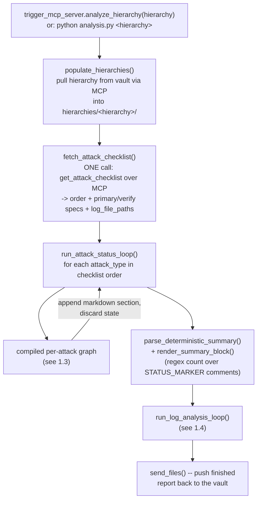
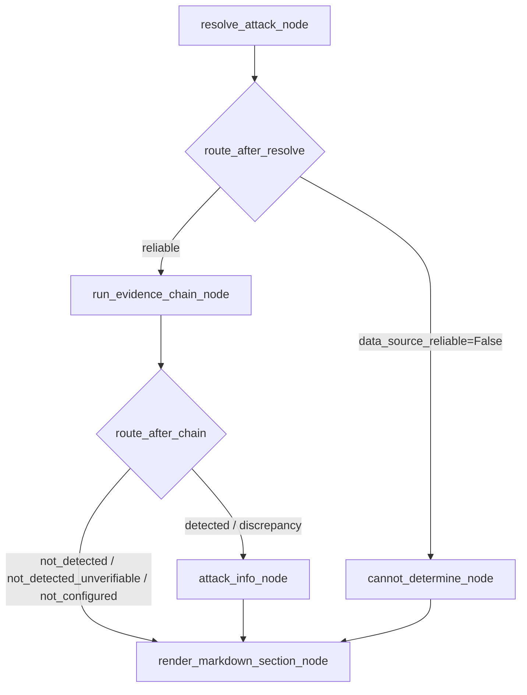
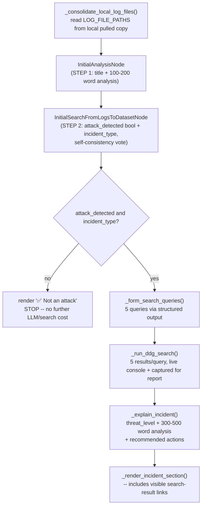

# Cybersecurity Log Analysis Agent — Technical Documentation

This document is the technical reference for the LangGraph-based analysis
pipeline: its architecture, how to install and run it, what each moving
part is for, and exactly what each phase of a run does and which code does
it. For the high-level two-machine split (vault vs. analysis) and
day-to-day setup, see [README.md](README.md); this document goes one
level deeper. For the design rationale behind this architecture (and what
it replaced), see [EVIDENCE_ENGINE_DESIGN.md](EVIDENCE_ENGINE_DESIGN.md).
For adding a new attack type, see
[ADDING_ATTACK_TYPES.md](ADDING_ATTACK_TYPES.md).

---

## 1. Architecture

### 1.1 The two machines

```
hierarchy_system/   — runs on the VAULT machine, owns rationalVault/data
analysis_system/    — runs on the ANALYSIS machine, runs the LangGraph pipeline
```

They talk over MCP (FastMCP), HTTP, no auth/TLS — intended for a trusted
internal network only. `hierarchy_system` never imports LangChain,
LangGraph, or anything Ollama-related; `analysis_system` never runs on
the vault machine and has no local copy of, or opinion about, which
attack types exist — that's entirely the vault's `.env`.

### 1.2 Top-level flow

One run processes one hierarchy path (e.g. `5/101/1/4/1`) end to end: pull
that hierarchy's files from the vault, fetch the attack checklist, run
every configured attack-type check, run the catch-all log-analysis pass,
write one combined markdown report, push it back to the vault.



The top-level driver, `run_full_workflow` in `analysis_system/analysis.py`:

```python
def run_full_workflow(
    hierarchy: str,
    vault_root: str = DEFAULT_VAULT_ROOT,
    hierarchies_dir: Path = DEFAULT_HIERARCHIES_DIR,
    sync_with_vault: bool = True,
) -> dict:
    hierarchy_clean = hierarchy.strip("/\\")

    if sync_with_vault:
        populate_hierarchies(vault_root, hierarchies_dir, hierarchy_clean)

    checklist = fetch_attack_checklist()   # ONE call per run, not per attack type

    reports_dir = hierarchies_dir / hierarchy_clean / "reports"
    report_path = reports_dir / f"attack_status_report_{datetime.now():%Y-%m-%d_%H-%M-%S}.md"

    local_root = str(hierarchies_dir) if sync_with_vault else vault_root
    attack_status_elapsed = run_attack_status_loop(hierarchy, local_root, report_path, checklist)

    summary_counts = parse_deterministic_summary(report_path)
    _append_report(report_path, render_summary_block(summary_counts))

    log_analysis_result = run_log_analysis_loop(hierarchy, Path(local_root), report_path,
                                                 checklist.get("log_file_paths"))

    if sync_with_vault:
        send_files(str(report_path), "upload_file",
                   relative_path=f"{hierarchy_clean}/reports/{report_path.name}")

    return {"hierarchy": hierarchy, "report_path": str(report_path),
            "summary_counts": summary_counts, "log_analysis": log_analysis_result, ...}
```

Key point: the attack checklist is fetched **once**, before the loop —
every attack type's `resolve_attack_node` is then a plain in-memory dict
lookup (`state["checklist"]["attacks"][attack_type]`), not a network
call. Reads inside the loop resolve against the **local pulled copy**
(`hierarchies_dir`), not the remote `vault_root` — `--no-sync` skips the
pull/push and reads/writes `vault_root` directly, for local testing
against a filesystem path that's already local.

### 1.3 The per-attack graph

Compiled once (`build_attack_graph()` / `_get_attack_graph()`), invoked
once per attack type in `run_attack_status_loop`:



- **`resolve_attack_node`** — looks up this attack type's config from the
  fetched checklist: `writer_script`, `ui_feature_name`, `caveat`,
  `primary_specs`, `verify_specs`, `data_source_reliable`.
- **`route_after_resolve`** — `ATTACK_RELIABLE_<type>=false` routes
  straight to `cannot_determine_node`, before any file is even read.
- **`run_evidence_chain_node`** — the actual evidence resolution (§2).
  Determines `final_status`: one of `detected`, `discrepancy`,
  `not_detected`, `not_detected_unverifiable`, `not_configured`,
  `cannot_determine`.
- **`attack_info_node`** — only for `detected`/`discrepancy`. Runs its
  **own** DuckDuckGo search (`"what is a <type> cyberattack"` /
  `"how to respond to and remediate a <type> attack"`) and synthesizes a
  short explanation + recommended actions. Unrelated to the per-source
  judgment above — same model, general instruction-following, not the
  fine-tuned DETECTED/CLEAN classification behavior.
- **`render_markdown_section_node`** — renders this attack type's whole
  section, shape depending on `final_status` (§2.4).

### 1.4 The log-analysis pass

Runs once per hierarchy, always, after every attack-type check — a
catch-all over whatever raw logs are configured, independent of the
per-attack-type checklist entirely:



Only ever **one** incident per run (the classification step picks a
single `incident_type` or none) — there's no primary/secondary role to
render, unlike the old design. If `attack_detected` is false or
`incident_type` is empty, the pass stops immediately after STEP 2 and
skips the DDG search + explanation entirely, which is what keeps a clean
run's log-analysis phase fast (confirmed: this is the single biggest
lever on total run time — see §7).

---

## 2. Evidence resolution mechanics

### 2.1 Source spec syntax

`_parse_source_spec(spec)`:

| Spec | Parsed as | Meaning |
|---|---|---|
| `path` | `([path], None)` | whole file, read as text |
| `path#tag` | `([path], tag)` | one XML element's text from that file |
| `pathA;pathB` | `([pathA, pathB], None)` | combined into ONE reading |

A comma **outside** any one spec string (in the raw `ATTACK_PRIMARY_<type>`
value) separates **co-equal sources** — `_split_csv` in
`hierarchy_system/mcp_server.py` splits on it before the specs even reach
`analysis.py`. Each resulting spec is evaluated independently by
`_evaluate_source`.

### 2.2 Reading a source

`_read_evidence_source(hierarchy_root, spec)`:

- **XML tag** (`tag` is set): `_read_xml_tag` parses the single named
  file, `root.find(tag_name)` — works regardless of the file's actual
  root element name, just searches for a matching child anywhere at the
  top level. Returns `(value, existed)` — `existed=False` only means the
  *file* is missing; a malformed file or absent tag returns
  `(None, True)`, a real distinction (see §2.4, `not_configured` vs. a
  clean-but-tag-missing read).
- **Plain text / log** (no tag): every path is glob-matched as a
  **prefix** (`path*`) against the hierarchy root — this transparently
  matches a rotating log's real on-disk name (`gateway.log_230`,
  `rationalclient.log_237`, ...) as well as a non-rotating file's bare
  name, with no separate "rotates" flag needed. Files are read via
  `_read_text_file`, capped at 8000 chars (single match) or 20000 chars
  (multiple matches — a `;`-joined spec, or a rotated log with several
  numbered copies present).
- **Multiple matches** get a `--- path ---` header per file and are
  joined into one blob — never judged file-by-file. A file that's
  ambiguous alone (e.g. an expected-empty detail file) can be
  unambiguous combined with its sibling.

### 2.3 Judging content

`_judge_content_with_model(attack_type, content)` — the one judgment call
every evidence source goes through, **unless** it's a literal-phrase
source (§2.5). Reuses `cybersecqwen`'s exact fine-tuning format verbatim:

```python
template = ChatPromptTemplate.from_messages([
    ("system", CYBERSECQWEN_JUDGE_SYSTEM_PROMPT),
    ("user", "Source: {attack_type}\n\nContent:\n{content}"),
])
```

expecting back `"Status: DETECTED|CLEAN. <1-3 sentence explanation>"` —
though in practice the model doesn't always reproduce that exact leading
label (`"DETECTED\n\n..."`, `"The content is CLEAN...."`,
`"Classification: CLEAN\n..."` have all been observed), so the verdict is
extracted by searching for `\b(DETECTED|CLEAN)\b` anywhere in the response
rather than anchoring on a leading `"Status:"` prefix.

**XML-tag content is wrapped** as `"<ALERT>\n  <Tag>value</Tag>\n</ALERT>"`
before being sent — this exact wrapper is how the training data represents
every tag reading regardless of the tag's real source file/root element
(confirmed: a bare unwrapped value is out-of-distribution and pushes the
model toward guessing "detected" almost regardless of the actual value).
Plain-text/log sources are sent as-is, matching how those were trained.
The `content` field stored on the result (for display in the report's
"Corroborating raw evidence" block) is this *same* wrapped/judged content
— not a trimmed bare value — so the report shows exactly what the model
actually saw.

**Free resolutions (no model call at all):**
- Missing file → `not_detected`, "not configured to sync" (§2.4).
- Present but empty value → `not_detected`, "no content to judge."
- A `LITERAL_PHRASE_SOURCES` match (§2.5) → deterministic substring check.

### 2.4 The six `final_status` outcomes

Derived in `run_evidence_chain_node`:

| Status | When | Rendered as |
|---|---|---|
| `detected` | Any primary source reads `detected` | Full section: triggering evidence, raw evidence, attack explainer, search-result links |
| `discrepancy` | Every primary read clean, but a verification source read `detected` | ⚠ tag said clean but evidence disagreed; recommends re-running the dashboard feature |
| `not_detected` | Every primary clean AND every configured verification source clean (a missing verify file counts as clean here, §3.1) | ✅ verified clean across N sources |
| `not_detected_unverifiable` | Every primary clean, **no verification tier configured at all** for this attack type | ✅ not detected, but explicitly notes this couldn't be cross-checked |
| `not_configured` | The **first** primary source's file doesn't exist at all | ❓ not a clean result — this file was never configured to sync from the client for this hierarchy |
| `cannot_determine` | `ATTACK_RELIABLE_<type>=false` | ⛔ explicitly not treated as either detected or clean; shows the caveat |

Note the asymmetry in `not_configured`: only the *first* primary source's
absence triggers it (checked once, at `i == 0` in the primary loop) — a
later co-equal primary source being absent just means one fewer source to
check, since any remaining one can still resolve the attack type.

`not_detected_unverifiable` is rendered with the display label
`"NOT DETECTED"` (the same as `not_detected`) — the verified/unverified
distinction is conveyed by the surrounding prose (the `STATUS_MARKER`
HTML comment still carries the real internal value for
`parse_deterministic_summary`'s regex count), not a separate status word
in the human-facing heading.

### 2.5 The literal-phrase exception

`analysis.py`'s `LITERAL_PHRASE_SOURCES` registry:

```python
LITERAL_PHRASE_SOURCES: dict[tuple[str, str], str] = {
    ("gateway_unauthorized_breakin", "home/athinio/data/1cloudFiler/log/gateway.log"): "Possible Break-in Attempt",
}
```

Checked in `_evaluate_source` before the model-judgment branch — if the
`(attack_type, file)` pair matches, the result is a plain substring
check (`phrase in content`), resolved instantly with no model call. This
is a narrow, deliberate exception for sources whose real writer script's
entire detection logic is itself a literal grep (confirmed from source),
not a general reversion to pattern-matching — see
[EVIDENCE_ENGINE_DESIGN.md §4](EVIDENCE_ENGINE_DESIGN.md#4-the-one-deliberate-exception-literal-phrase-sources)
for why this exists and how it was arrived at.

---

## 3. `hierarchy_system/.env` schema

The single source of truth for what gets checked, read by
`get_attack_checklist` (`hierarchy_system/mcp_server.py`):

```bash
ATTACK_ORDER=type_a,type_b,...              # which types, and in what order

ATTACK_PRIMARY_type_a=Alert.xml#tag_a       # required per type
ATTACK_VERIFY_type_a=alertlog.xml#tag_a     # optional
ATTACK_WRITER_type_a="script.sh -> ..."     # optional, human-readable provenance
ATTACK_UI_FEATURE_type_a="Feature Name"     # optional
ATTACK_RELIABLE_type_a=false                # optional, default true
ATTACK_CAVEAT_type_a="..."                  # optional, free text

LOG_FILE_PATHS=var/log/messages,var/log/secure,var/log/audit.log   # optional
```

See [ADDING_ATTACK_TYPES.md](ADDING_ATTACK_TYPES.md) for the full cookbook
on populating this, and `hierarchy_system/.env.example` for the schema
with worked examples inline.

`LOG_FILE_PATHS` entries are either absolute server-side paths (used
as-is) or paths relative to the hierarchy being analyzed, resolved as
`<local_root>/<hierarchy>/<path>` by `_consolidate_local_log_files`.
Falls back to `var/log/messages`, `var/log/secure`, `var/log/audit.log`
if unset.

### 3.1 Per-hierarchy data layout

Every path below is resolved relative to `rationalVault/data/<hierarchy>/`
(e.g. `rationalVault/data/5/101/1/4/1/`) on the vault machine — this is
the complete set of real files the currently-configured `.env` reads,
generated directly from it (`ATTACK_PRIMARY_<type>`/`ATTACK_VERIFY_<type>`/
`LOG_FILE_PATHS`, every source across all 34 currently-configured attack
types). It will drift as attack types are added/changed — the `.env`
itself is the only truly authoritative source; treat this table as a
point-in-time derived reference, not something to hand-maintain in sync.

| Path | Rotates? | Read by (attack type) |
|---|---|---|
| `Alert.xml` | no | `authentication_failures_threshold`, `database_ransomware`, `file_integrity_violation`, `gateway_breach_activity`, `gateway_ransomware_backup`, `gateway_ransomware_filesystem`, `gateway_unauthorized_breakin`, `honeypot`, `honeypot_process_triggered`, `log_disable`, `log_tampering_detected`, `monitoring_agent_disabled`, `network_anomaly_detected`, `process_anomaly`, `ransomware`, `security_config`, `special_folder_monitoring`, `ssh_key_injection_detected`, `suspicious_commands_detected`, `unauthorized_ddl`, `unknown_binary_detection`, `user_breach` |
| `athinio/security/dataprotection.xml` | no | `dlp_data_exposure` |
| `athinio/security/malwarefiles.xml` | no | `clam_malware` |
| `athinio/system/alertlog.xml` | no | `config_xml_drift`, `gateway_breach_activity`, `gateway_ransomware_backup`, `gateway_ransomware_filesystem`, `gateway_unauthorized_breakin`, `honeypot`, `immutable_attribute_drift`, `log_disable`, `onegrid_config_drift`, `process_anomaly`, `ransomware`, `secure_vault_ransomware`, `unknown_binary_detection`, `user_breach` |
| `athinio/system/nouser_noowner.xml` | no | `orphaned_files` |
| `athinio/system/secOpsOutput_91` | no | `rootkit_malware` |
| `athinio/system/secOpsOutput_94` | no | `config_drift` (primary; whole-file text) |
| `athinio/system/secOpsOutput_96` | no | `immutable_attribute_drift` (verify) |
| `athinio/system/secOpsOutput_112` | no | `unknown_binary_detection` (verify) |
| `athinio/system/secOpsOutput_128` | no | `special_folder_monitoring` (verify) |
| `athinio/system/user_emptypass_list.xml` | no | `weak_password_accounts` |
| `athinio/system/zero_uid.xml` | no | `unauthorized_uid0_account` |
| `athinio/tmp/imm_changes` | no | `immutable_attribute_drift` (verify, combined with `secOpsOutput_96`) |
| `home/athinio/data/1cloudFiler/log/gateway.log` | **yes** | `gateway_unauthorized_breakin` (verify; also a `LITERAL_PHRASE_SOURCES` entry, §2.5) |
| `rationalVault/log/rationalclient.log` | **yes** | `config_drift`, `unknown_binary_detection` (both combined with `osstatus.log`), `user_breach` (combined with `var/log/secure`) |
| `var/log/osstatus.log` | **yes** | `config_drift`, `unknown_binary_detection` |
| `var/log/secure` | no | `user_breach` (verify) — also read by the catch-all log-analysis pass |
| `var/log/messages`, `var/log/audit.log` | no | catch-all log-analysis pass only (§1.4) — no attack-type check reads these directly |
| `var/neridio/banned_ip.xml` | no | `banned_ip_bruteforce` (primary; whole-file text) |

Rows marked **rotates** are only ever present on the real system under a
numbered suffix (`gateway.log_230`, `rationalclient.log_237`, ...), never
the bare filename — `_read_evidence_source`'s prefix-glob (`path*`)
handles this transparently, matching every numbered copy present and
combining them into one reading (§2.2) as well as matching a bare,
non-rotating filename if that's ever what exists instead.

**None of this is a hard requirement for a run to succeed.** A missing
**primary**-tier file resolves that attack type as `not_configured`. A
missing **verify**-tier file, when a verify tier IS configured, is
treated as clean by default (same free resolution as an empty file, §2.3)
— confirmed this actually produces `not_detected` (verified clean), *not*
`not_detected_unverifiable`; that status specifically means no verify
tier was configured for this attack type at all, not that a configured
one's file happened to be missing. Nothing in `run_attack_status_loop`
errors on an absent file — see §2.4.

---

## 4. MCP transport

`analysis_system/analysis.py` is an MCP **client** toward
`hierarchy_system/mcp_server.py` (three tools: `fetch_directory_files`,
`upload_file`, `get_attack_checklist`) and an MCP **server** itself via
`trigger_mcp_server.py` (one tool: `analyze_hierarchy(hierarchy, vault_root)`,
which just calls `run_full_workflow`).

`_call_mcp_tool`/`_extract_tool_result` handle a real fastmcp quirk: a
bare `dict`/`list` return value can come back wrapped as
`{"result": ...}` in the wire-format JSON depending on fastmcp version —
`_unwrap_result_envelope` strips that unambiguously, since none of these
three tools' real results are ever themselves shaped like `{"result": ...}`.

`populate_hierarchies` mirrors the server-side
`{company}/{customer}/{branch}/{product}/{system}` layout locally under
`hierarchies_dir/<hierarchy>/`; `decode_file_content` handles the
base64-vs-utf-8 encoding `fetch_directory_files` uses for binary vs. text
files.

---

## 5. Report structure

One markdown file per run:
`hierarchies/<hierarchy>/reports/attack_status_report_<timestamp>.md`.

1. Header (hierarchy, generated timestamp, attack-type count).
2. One `## <Attack Type>` section per configured attack type, in
   `ATTACK_ORDER`'s order — shape per §2.4.
3. `## Summary` — a plain count of each `final_status` value, computed by
   `parse_deterministic_summary` regex-scanning the `STATUS_MARKER` HTML
   comments already written (no extra LLM call).
4. `# Log Analysis (secure / messages / audit.log)` — either
   `✅ Not an attack` with the initial analysis shown, or a full incident
   section (title, threat level, 300-500 word analysis, recommended
   actions, search-result links) if one was found.

Every markdown write goes through `_append_report`, which mirrors it to
console `stdout` as it's produced — a live run's console output is
always a faithful, real-time copy of exactly what's landing in the file.

---

## 6. Setup & running

See [README.md](README.md) for the day-to-day setup steps. Code-level
notes:

- `analysis.py`'s CLI (`main()`):
  ```bash
  python analysis.py 5/101/1/4/1
  python analysis.py 5/101/1/4/1 --vault-root /rationalVault/data
  python analysis.py 5/101/1/4/1 --vault-root hierarchies --no-sync
  ```
  `--no-sync` skips the MCP pull/push entirely and reads/writes
  `--vault-root` directly as if it were already local — the attack
  checklist is **still** fetched over MCP either way (that's a separate,
  lightweight call, always needed).
- `trigger_mcp_server.py`'s `analyze_hierarchy(hierarchy, vault_root)` is
  the same `run_full_workflow` under the hood, just reachable over MCP
  instead of the CLI.
- Environment variables (`analysis_system/.env`, see `.env.example` for
  the full annotated list): `MCP_SERVER_URL`, `MODEL_NAME` (default
  `cybersecqwen`), `LOG_TAIL_LINES` (default 300 — caps how much of each
  configured log file the classification step sees), `CLASSIFICATION_VOTE_COUNT`
  (default 1 — self-consistency voting on `attack_detected`, off by
  default since each extra pass re-sends the full log text), `MODEL_REQUEST_TIMEOUT_SECONDS`
  (default 120), `MODEL_NUM_GPU` (unset = Ollama auto-decides).

---

## 7. Timing instrumentation

Every phase reports its own elapsed time, and `run_full_workflow` combines
them into one breakdown at the end:

```
##############################################################################
# ATTACK-STATUS PHASE: 34 types in 6m56.2s (avg 12.2s/type)
##############################################################################
       58.4s  ransomware
       56.2s  user_breach
       ...
##############################################################################
# LOG-ANALYSIS PHASE: 4m40.2s total (classification 4m40.0s, no attack detected)
##############################################################################
##############################################################################
# RUN TOTAL: 11m36.4s (attack-status phase: 6m56.2s, log-analysis phase: 4m40.2s)
##############################################################################
```

`run_attack_status_loop` prints a sorted top-10-slowest-attacks summary —
useful for spotting an attack type whose evidence chain is unexpectedly
walking a large verification tier, or a `LITERAL_PHRASE_SOURCES` source
that's still showing real latency (which would mean it *isn't* actually
hitting the deterministic branch — worth checking the `(attack_type, file)`
key matches exactly).

The single biggest lever on total run time is whether the log-analysis
pass's classification step finds an incident: a clean result stops right
after STEP 2 (§1.4), skipping the DDG search and 300-500-word explanation
generation entirely; a real incident pays that cost once, for the one
incident found.

---

## 8. The fine-tuned model

`cybersecqwen` is fine-tuned (QLoRA, on
`lablab-ai-amd-developer-hackathon/CyberSecQwen-4B`) specifically on
`content -> "Status: DETECTED|CLEAN. <explanation>"` pairs — see
`cybersecqwen_finetune/` for the training pipeline
(`generate_synthetic_dataset.py` for corpus-derived examples,
`generate_new_attack_examples.py` for new-attack-type/evidence-source-gap
examples, `build_combined_dataset.py` to fold both into
`finetune_dataset/train.jsonl`/`val.jsonl`, `kaggle_finetune_cybersecqwen.ipynb`
to actually train and export a `.gguf`).

**Validating a retrain** — two levels, used throughout this project's
development:
1. A held-out + OOD regression suite (the notebook's own `HELD_OUT_CASES`/
   `OOD_CASES` cells, or an equivalent local script calling
   `_judge_content_with_model` directly) — fast, ~36 cases, catches gross
   regressions in seconds.
2. An exhaustive sweep of every tag in every configured attack type at
   both DETECTED(1) and CLEAN(0), through `_evaluate_source` (not
   `_judge_content_with_model` directly — that bypasses the
   `LITERAL_PHRASE_SOURCES` shortcut and any other pipeline-level logic).
   This is what actually caught, and later confirmed fixed, the
   `gateway_unauthorized_breakin` trap case across five retrains — see
   [ADDING_ATTACK_TYPES.md](ADDING_ATTACK_TYPES.md#testing-a-new-or-changed-source)
   for the exact pattern.

**Packaging a retrained model for release:**
```bash
# after exporting the notebook's .gguf to analysis_system/model/cybersecqwen.gguf
scripts/package_release.sh
```
See [README.md § Packaging and installing](README.md#packaging-and-installing).

---

## 9. Known limitations

- No auth/TLS on either MCP server — trusted-network deployments only.
- The literal-phrase exception (§2.5) is currently a single hardcoded
  registry entry; if more sources turn out to need it, consider whether
  it's worth promoting to an `.env`-driven `ATTACK_LITERAL_PHRASE_<type>`
  variable instead of a code change — not done yet since one confirmed
  case didn't justify the extra config surface.
- `attack_info_node`'s "what is this attack" search and the log-analysis
  incident's search are two independent DDG calls with separate query
  strategies — there's no shared cache between them within one run, so a
  detected attack type's report pays for both if the log-analysis pass
  also finds an incident in the same run.
- Rotating-log prefix matching (`path*`) has no upper bound on how many
  numbered copies it will combine into one reading — a hierarchy with an
  unusually large number of rotated files could produce a very large
  combined blob (capped at 20000 chars, but that cap is per-reading, not
  per-file).
