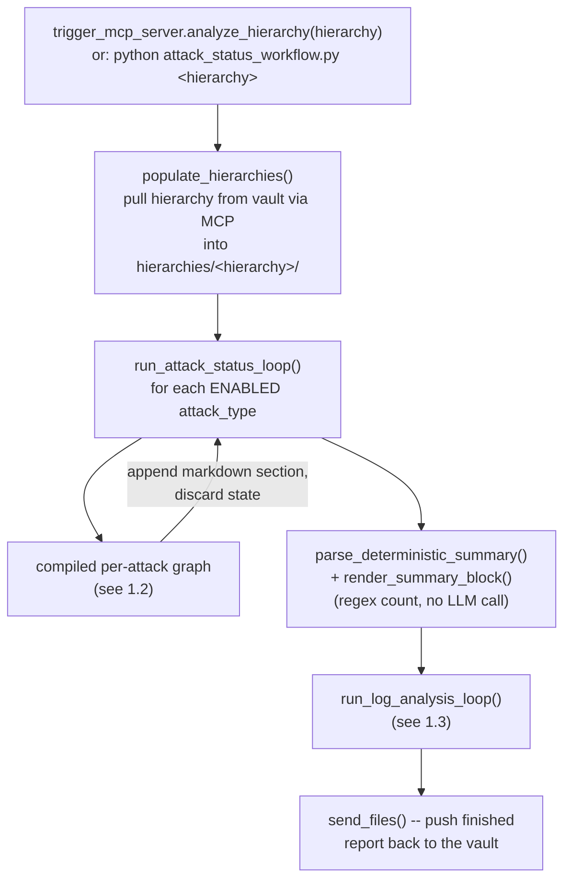
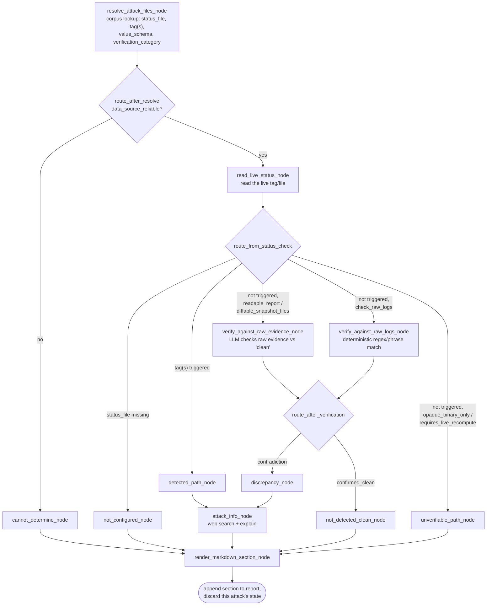
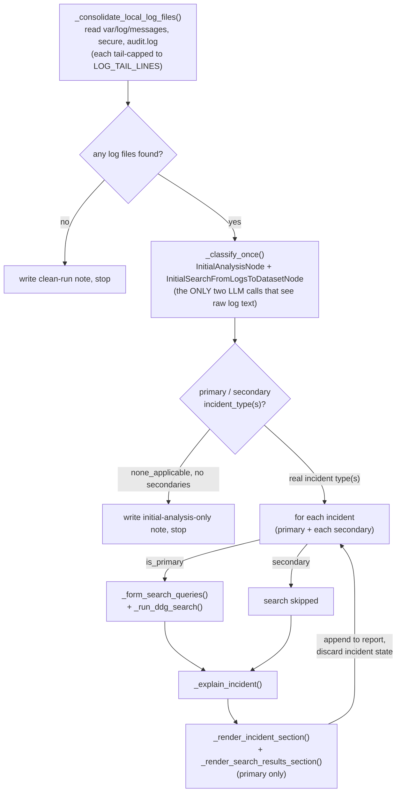

# Cybersecurity Log Analysis Agent — Technical Documentation

This document is the technical reference for the LangGraph-based analysis
pipeline: its architecture, how to install and run it, what each moving
part is for, and — attack type by attack type — exactly what each step of
the pipeline checks and which code does it. For the high-level two-machine
split (vault vs. analysis) and day-to-day setup, see [README.md](README.md);
this document goes one level deeper into the analysis pipeline itself.

---

## 1. Architecture

### 1.1 Top-level flow

One run processes one hierarchy path (e.g. `5/101/1/4/1`) end to end:
pull that hierarchy's files from the vault, run every enabled attack-type
check, run the secure/messages/audit.log catch-all, write one combined
markdown report, push it back to the vault.



The top-level driver, in `analysis_system/attack_status_workflow.py`:

```python
def run_full_workflow(
    hierarchy: str,
    vault_root: str = DEFAULT_VAULT_ROOT,
    hierarchies_dir: Path = DEFAULT_HIERARCHIES_DIR,
    sync_with_vault: bool = True,
) -> dict:
    hierarchy_clean = hierarchy.strip("/\\")

    # Pull this hierarchy's vault data down to a local working copy via MCP.
    # sync_with_vault=False skips this (and the push-back at the end) for
    # local testing against a filesystem path that's already local.
    if sync_with_vault:
        print(f"Pulling {vault_root}/{hierarchy_clean} -> {hierarchies_dir / hierarchy_clean} ...")
        populate_hierarchies(vault_root, hierarchies_dir, hierarchy_clean)

    reports_dir = hierarchies_dir / hierarchy_clean / "reports"
    reports_dir.mkdir(parents=True, exist_ok=True)
    report_path = reports_dir / f"attack_status_report_{datetime.now().strftime('%Y-%m-%d_%H-%M-%S')}.md"

    local_root = str(hierarchies_dir) if sync_with_vault else vault_root
    run_attack_status_loop(hierarchy, local_root, report_path)

    summary_counts = parse_deterministic_summary(report_path)
    with open(report_path, "a", encoding="utf-8") as f:
        f.write(render_summary_block(summary_counts))

    # Catch-all: secure/messages/audit.log, appended into THIS SAME report.
    # Always runs, after the attack checks -- not opt-in.
    from lib.log_analysis_workflow import run_log_analysis_loop
    log_analysis_result = run_log_analysis_loop(hierarchy, Path(local_root), report_path)

    # Push the finished report back up to the vault, alongside the source
    # files it was generated from.
    vault_upload_result = None
    if sync_with_vault:
        vault_upload_result = send_files(
            str(report_path), "upload_file",
            relative_path=f"{hierarchy_clean}/reports/{report_path.name}",
        )
        print(f"Uploaded report to vault: {vault_upload_result}")

    return {
        "hierarchy": hierarchy,
        "report_path": str(report_path),
        "summary_counts": summary_counts,
        "log_analysis": log_analysis_result,
        "vault_upload_result": vault_upload_result,
    }
```

Both the per-attack loop and the log-analysis loop are deliberately
**context-flat**: each iteration (one attack type, or one log-derived
incident) runs as a fresh, isolated invocation, appends its own markdown
section to the same report file on disk, and then everything about that
iteration — evidence text, search results, LLM output — goes out of scope.
Nothing carries forward into the next iteration except what's already been
written to the file. This is why processing 23 attack types plus several
log incidents doesn't grow the prompt size of any single LLM call as the
run progresses.

### 1.2 Per-attack-type graph

Every attack type — `ransomware`, `user_breach`, `config_drift`, all 23 —
runs through the exact same compiled LangGraph, just parameterized by that
attack type's own corpus entry. This is the one graph diagram that applies
to all of them; §5 covers what's different per attack type.



The graph assembly itself, in `analysis_system/attack_status_workflow.py`:

```python
def build_attack_graph():
    workflow = StateGraph(AttackState)

    workflow.add_node("resolve", resolve_attack_files_node)
    workflow.add_node("read_status", read_live_status_node)
    workflow.add_node("detected", detected_path_node)
    workflow.add_node("unverifiable", unverifiable_path_node)
    workflow.add_node("cannot_determine", cannot_determine_node)
    workflow.add_node("not_configured", not_configured_node)
    workflow.add_node("verify", verify_against_raw_evidence_node)
    workflow.add_node("verify_raw_logs", verify_against_raw_logs_node)
    workflow.add_node("not_detected_clean", not_detected_clean_node)
    workflow.add_node("discrepancy", discrepancy_node)
    workflow.add_node("attack_info", attack_info_node)
    workflow.add_node("render", render_markdown_section_node)

    workflow.set_entry_point("resolve")

    workflow.add_conditional_edges("resolve", route_after_resolve, {
        "cannot_determine": "cannot_determine",
        "read_status": "read_status",
    })

    workflow.add_conditional_edges("read_status", route_from_status_check, {
        "detected": "detected",
        "verify": "verify",
        "verify_raw_logs": "verify_raw_logs",
        "unverifiable": "unverifiable",
        "not_configured": "not_configured",
    })

    workflow.add_conditional_edges("verify", route_after_verification, {
        "discrepancy": "discrepancy",
        "confirmed_clean": "not_detected_clean",
    })

    workflow.add_conditional_edges("verify_raw_logs", route_after_verification, {
        "discrepancy": "discrepancy",
        "confirmed_clean": "not_detected_clean",
    })

    workflow.add_edge("detected", "attack_info")
    workflow.add_edge("discrepancy", "attack_info")
    workflow.add_edge("attack_info", "render")
    workflow.add_edge("not_detected_clean", "render")
    workflow.add_edge("unverifiable", "render")
    workflow.add_edge("cannot_determine", "render")
    workflow.add_edge("not_configured", "render")
    workflow.add_edge("render", END)

    return workflow.compile()
```

Six possible `final_status` outcomes come out of this graph:
`detected`, `discrepancy`, `not_detected`, `not_detected_unverifiable`,
`not_configured`, `cannot_determine` — see §5.1 for what each means and
which node sets it.

### 1.3 Log analysis flow

Runs once, after every attack type has been checked, reading
`var/log/{messages,secure,audit.log}` from the **same already-pulled local
copy** (no second vault fetch). Full step-by-step code in §6.



### 1.4 Input files required

**From the vault, per hierarchy** (pulled locally by
`lib/populate_hierarchies.py`, read by the attack-status graph):

| File (relative to the hierarchy root) | Used by |
|---|---|
| `Alert.xml` | The primary customer-facing status file — most attack types' tag(s) live here |
| `athinio/system/alertlog.xml` | Upstream of many `Alert.xml` tags; also the sole home of a few tags that never roll up (`lsattr_status`, `SV_Ransom_current_status`, `User_breach`/`suspicious_user_login`) |
| `athinio/system/secOpsOutput_91/94/96/105/112/128` and similar | Per-attack raw evidence/output files (rkhunter output, config-drift text scan, immutable-attribute alert lines, breach detail, unknown-binary detail, special-folder detail) |
| `athinio/system/aide_report.txt`, `athinio/system/rootkitscan.txt` | Supplementary evidence for `rootkit_malware` |
| `athinio/security/malwarefiles.xml`, `athinio/security/dataprotection.xml` | `clam_malware` / `dlp_data_exposure` counts |
| `var/neridio/banned_ip.xml` | `banned_ip_bruteforce` (presence check) |
| `athinio/system/user_emptypass_list.xml`, `athinio/system/zero_uid.xml`, `athinio/system/nouser_noowner.xml` | Weak-password / UID-0 / orphaned-file audits |
| `var/log/secure*`, `rationalVault/log/rationalclient.log*` | `user_breach`'s raw-log check, and `process_anomaly`'s evidence |
| `home/athinio/data/1cloudFiler/log/gateway.log*` | `gateway_unauthorized_breakin`'s raw-log check |
| `var/log/messages`, `var/log/secure`, `var/log/audit.log` | The log-analysis catch-all (§1.3), configurable via `LOG_FILE_PATHS` |

**Local to the analysis machine** (not per-hierarchy):

| File | Used by |
|---|---|
| `corpus_documents/attack_*.json` (23 files) + reference-file entries | Ingested into `corpus_db/` by `ingest_corpus.py` — every attack type's `status_file`/`status_tag`/`value_schema`/etc. comes from here, not a flat config file |
| `analysis_system/model/Modelfile` + `cybersecqwen.gguf` | Builds the local Ollama model (see §4.2) |
| `analysis_system/.env` | `MCP_SERVER_URL`, `LOG_FILE_PATHS`, `LOG_TAIL_LINES`, `CLASSIFICATION_VOTE_COUNT`, `ENABLED_ATTACK_TYPES`, `CORPUS_SERVER_URL` — see `.env.example` |
| `hierarchy_system/.env` | `ANALYSIS_SERVER_URL`, optional `DATA_ROOT` |

### 1.5 Brief working

1. A trigger (either `trigger_mcp_server.py`'s `analyze_hierarchy` MCP
   tool, or running `attack_status_workflow.py` directly) names a
   hierarchy path.
2. That hierarchy's files are pulled from the vault machine over MCP into
   a local working copy.
3. Every **enabled** attack type (all 23 by default, or a subset via
   `ENABLED_ATTACK_TYPES`) is checked independently: read its live tag,
   decide detected/clean/unverifiable/not-configured, optionally verify a
   "clean" read against raw evidence, explain a "detected" or
   "discrepancy" result, render one markdown section, append it, discard.
4. A deterministic summary (a regex count over the appended sections'
   status markers) is appended.
5. The three canonical logs are read from the same local pull and
   classified once into a primary + secondary incident type(s); each gets
   its own isolated search-and-explain pass (primary only gets the web
   search) and its own appended section.
6. The finished report is pushed back to the vault next to the source
   files it was generated from.

---

## 2. Installation

Full detail (Rocky Linux 8 + Windows installers, tar packaging) is in
[README.md's Packaging and installing section](README.md#packaging-and-installing). Summary:

### 2.1 Packaged install (recommended for a real deployment)

```bash
scripts/package_release.sh          # builds dist/analysis_system.tar.gz, dist/hierarchy_system.tar.gz
```

This needs `analysis_system/model/cybersecqwen.gguf` to exist first —
either place it there yourself (next to the already-committed `Modelfile`;
no Ollama needed on the packaging machine in that case), or run this on a
machine that already has the model built in Ollama and let it call
`scripts/export_model.sh` automatically. `package_release.sh` uses
whichever `.gguf` is already present and only falls back to exporting from
Ollama if none is found.

On each target machine:

```bash
tar -xzf analysis_system.tar.gz     # or hierarchy_system.tar.gz
cd analysis_system                  # or hierarchy_system
./install.sh                        # sudo ./install.sh on Rocky Linux 8
```

`analysis_system/install.sh` detects the platform (Rocky/RHEL via `dnf`,
or Windows via `winget` under Git Bash), installs Python 3.11 + a venv +
`requirements.txt`, installs Ollama, builds `cybersecqwen` from the
bundled `model/Modelfile`, and ingests `corpus_documents/*.json` into the
vector store via a temporarily-started `corpus_server.py`.
`hierarchy_system/install.sh` does the same Python/venv/requirements setup
only (no Ollama needed there).

### 2.2 Manual / development setup

```bash
cd analysis_system
python -m venv venv && source venv/bin/activate   # venv\Scripts\Activate.ps1 on Windows
pip install -r requirements.txt

ollama pull nomic-embed-text                       # embedding model for corpus_server.py
ollama create cybersecqwen -f model/Modelfile       # or: ollama pull <a model>, set MODEL_NAME

cp .env.example .env                                # then edit MCP_SERVER_URL etc.

python corpus_server.py &                           # start the corpus vector store (port 8003)
python ingest_corpus.py                              # one-shot: load corpus_documents/*.json into it
```

```bash
cd hierarchy_system
python -m venv venv && source venv/bin/activate
pip install -r requirements.txt
cp .env.example .env                                 # then edit ANALYSIS_SERVER_URL
```

---

## 3. Usage

**Bring the services up** (vault machine, then analysis machine):

```bash
# vault machine
python mcp_server.py    # :8002 -- serves file reads/writes to the analysis machine

# analysis machine -- use start.sh rather than starting each process by hand
cd analysis_system
./start.sh               # starts corpus_server.py, then trigger_mcp_server.py, in the background
```

`start.sh` (installed by `analysis_system/install.sh`, §2.1) writes
`corpus_server.pid`/`trigger_mcp_server.pid` and waits between the two
starts so `trigger_mcp_server.py` doesn't come up before the corpus store
it depends on is ready; stop both with `kill $(cat corpus_server.pid)
$(cat trigger_mcp_server.pid)`. If you're working from a manual/dev setup
(§2.2) without `start.sh` in place, the equivalent by hand is:

```bash
python corpus_server.py &               # :8003 -- start first
python trigger_mcp_server.py            # :8001 -- accepts "analyze this hierarchy" requests
```

**Trigger an analysis** — three equivalent ways:

```bash
# 1. From the vault machine, over MCP (the normal path)
cd hierarchy_system
python trigger_mcp_client.py 5/101/1/4/1

# 2. Directly on the analysis machine, full pipeline (attack checks + log analysis, one report)
cd analysis_system
python attack_status_workflow.py 5/101/1/4/1
python attack_status_workflow.py 5/101/1/4/1 --vault-root /rationalVault/data --no-sync   # local testing, no MCP pull/push

# 3. Log analysis alone, against an already-pulled hierarchy (no vault pull of its own)
python -m lib.log_analysis_workflow 5/101/1/4/1
```

Output, per hierarchy, under `hierarchies/<hierarchy>/reports/`:
`attack_status_report_<timestamp>.md` — the combined report (attack-status
sections, then the log-analysis section, then the summary block).

---

## 4. Parts explained

### 4.1 Libraries

| Library | Used for |
|---|---|
| `langgraph` | `StateGraph`/`END` — the per-attack graph in `attack_status_workflow.py` |
| `langchain-core` | `ChatPromptTemplate` — every LLM prompt in both workflows |
| `langchain-ollama` | `ChatOllama` (the LLM client, `lib/llm_client.py`) and `OllamaEmbeddings` (`corpus_server.py`) |
| `pydantic` | `BaseModel`/`Field` — every structured-output schema (`EvidenceVerificationResult`, `InitialAnalysisTemplate`, `ExplainerOutputTemplate`, etc.) |
| `ddgs` | `DDGS().text(...)` — DuckDuckGo search, used by `attack_info_node` and `_run_ddg_search` |
| `fastmcp` | `FastMCP`/`Client` — every MCP server (`mcp_server.py`, `trigger_mcp_server.py`, `corpus_server.py`) and client (`mcp_client.py`, `corpus_client.py`, `trigger_mcp_client.py`) |
| `chromadb` | `PersistentClient` — the attack-corpus vector store (`corpus_db/`) |
| `python-dotenv` | `load_dotenv()` — reads `.env` in every entry-point module |

### 4.2 The model

The pipeline uses one local Ollama chat model (default name `cybersecqwen`,
override via `MODEL_NAME`) plus one embedding model (`nomic-embed-text`,
fixed, override via `CORPUS_EMBED_MODEL`).

`cybersecqwen` is defined by `analysis_system/model/Modelfile`:

```
FROM ./cybersecqwen.gguf
TEMPLATE "{{- range .Messages }}<|im_start|>{{ .Role }}
{{ .Content }}<|im_end|>
{{ end }}<|im_start|>assistant
"
PARAMETER stop <|im_start|>
PARAMETER stop <|im_end|>
PARAMETER temperature 0.2
PARAMETER top_p 0.9
PARAMETER num_ctx 8192
PARAMETER num_predict 4096
```

Low temperature (0.2) favors consistent, literal classification over
creative variation — this is a detection pipeline, not a chat assistant.
`num_ctx 8192` bounds the context window, which is why `LOG_TAIL_LINES`
(§1.4) matters for the log-analysis classification step specifically —
that's the one call still carrying full raw log text.

The `.gguf` weights are not committed to git (multi-gigabyte binary) —
they're produced from whatever Ollama already has built locally by
`scripts/export_model.sh`, which copies the real weight blob out of
Ollama's own blob store and rewrites the `Modelfile`'s `FROM` line to
point at the bundled relative file instead of a machine-local path.

The single shared client instance, `analysis_system/lib/llm_client.py`:

```python
import os
from langchain_ollama import ChatOllama

# Without an explicit request timeout, a stuck/overloaded Ollama call blocks
# forever with no signal to distinguish "slow" from "hung" -- this bounds it
# so a genuinely stuck call fails with a clear exception instead.
MODEL_REQUEST_TIMEOUT_SECONDS = float(os.getenv("MODEL_REQUEST_TIMEOUT_SECONDS", "120"))

# Set MODEL_NUM_GPU=0 to force pure CPU inference, for a controlled A/B test
# against the default GPU-assisted path -- a model that doesn't fully fit in
# VRAM gets split across GPU+CPU by Ollama, paying a PCIe round-trip per
# token, which can be slower than running the whole model on CPU alone.
MODEL_NUM_GPU = os.getenv("MODEL_NUM_GPU")

_model_kwargs = {
    "model": os.getenv("MODEL_NAME", "cybersecqwen"),
    "num_keep": 0,
    "sync_client_kwargs": {"timeout": MODEL_REQUEST_TIMEOUT_SECONDS},
}
if MODEL_NUM_GPU is not None:
    _model_kwargs["num_gpu"] = int(MODEL_NUM_GPU)

model = ChatOllama(**_model_kwargs)
```

---

## 5. Attack-status checks — step by step, per attack type

### 5.1 The shared steps (apply to every attack type)

All state is a plain dict matching this `TypedDict`, from
`analysis_system/attack_status_workflow.py`:

```python
class AttackState(TypedDict):
    attack_type: str
    hierarchy: str
    vault_root: str

    status_file: str
    status_tag: str
    meaning: str
    writer_script: str
    ui_feature_name: NotRequired[str | None]
    confidence: str
    verification_category: str
    value_schema: NotRequired[dict]
    raw_evidence_files: NotRequired[list[str]]
    caveat: NotRequired[str]
    data_source_reliable: NotRequired[bool]
    status_tags: NotRequired[list[str]]  # overrides status_tag when set

    live_value: NotRequired[str | None]
    tag_values: NotRequired[dict[str, str | None]]
    triggered_tags: NotRequired[list[str]]
    status_file_existed: NotRequired[bool]
    verification_outcome: NotRequired[str | None]   # confirmed_clean | contradiction
    verification_reasoning: NotRequired[str]
    final_status: NotRequired[str]                   # detected | not_detected | not_detected_unverifiable | discrepancy | not_configured | cannot_determine
    explainer_text: NotRequired[str]
    corroborating_evidence_text: NotRequired[str]
    markdown_section: NotRequired[str]
```

**1. Resolve** — exact-id corpus lookup for this attack type:

```python
def resolve_attack_files_node(state: AttackState) -> AttackState:
    entry = get_attack_entry(state["attack_type"])
    metadata = entry["metadata"]

    updated = dict(state)
    updated.update({
        "status_file": metadata["status_file"],
        "status_tag": metadata["status_tag"],
        "meaning": entry["explanation"],
        "writer_script": metadata.get("writer_script", "unknown"),
        "ui_feature_name": metadata.get("ui_feature_name"),
        "confidence": metadata.get("confidence", "unknown"),
        "verification_category": metadata["verification_category"],
        "value_schema": metadata.get("value_schema", {"type": "binary_flag"}),
    })
    if "raw_evidence_files" in metadata:
        updated["raw_evidence_files"] = metadata["raw_evidence_files"]
    if "caveat" in metadata:
        updated["caveat"] = metadata["caveat"]
    if "status_tags" in metadata:
        updated["status_tags"] = metadata["status_tags"]
    updated["data_source_reliable"] = metadata.get("data_source_reliable", True)
    return updated
```

**2. Reliability gate** — a known-unreliable data source (only
`secure_vault_ransomware`) is caught before it's ever read:

```python
def route_after_resolve(state: AttackState) -> str:
    return "cannot_determine" if not state.get("data_source_reliable", True) else "read_status"
```

**3. Read live status** — reads the live tag(s)/file according to
`value_schema["type"]` (§5.2):

```python
def read_live_status_node(state: AttackState) -> AttackState:
    file_path = _hierarchy_path(state["vault_root"], state["hierarchy"]) / state["status_file"]
    value_schema = state.get("value_schema") or {"type": "binary_flag"}

    if value_schema.get("type") == "file_contains_pattern":
        # e.g. config_drift's secOpsOutput_94, rootkit_malware's secOpsOutput_91 --
        # the whole file's text IS the evidence, not one XML tag.
        if not file_path.exists():
            return {**state, "live_value": None, "status_file_existed": False, "triggered_tags": []}
        content = _read_text_file(file_path, max_chars=8000)[0] or ""
        triggered = [state["status_tag"]] if _is_detected(content, value_schema) else []
        return {**state, "live_value": content, "status_file_existed": True, "triggered_tags": triggered}

    if value_schema.get("type") == "file_non_empty":
        # e.g. banned_ip_bruteforce's banned_ip.xml -- presence, not a tag value.
        if not file_path.exists():
            return {**state, "live_value": None, "status_file_existed": False, "triggered_tags": []}
        content = _read_text_file(file_path)[0] or ""
        live_value = "non_empty" if content.strip() else "empty"
        triggered = [state["status_tag"]] if _is_detected(live_value, value_schema) else []
        return {**state, "live_value": live_value, "status_file_existed": True, "triggered_tags": triggered}

    # status_tags (plural) overrides status_tag when an attack type is backed
    # by more than one related flag in the same file -- detection triggers
    # on ANY of them.
    status_tags = state.get("status_tags") or [state["status_tag"]]
    tag_values, file_existed = _read_xml_tags(file_path, status_tags)
    if not file_existed:
        return {**state, "live_value": None, "status_file_existed": False, "triggered_tags": []}

    triggered_tags = [tag for tag, value in tag_values.items() if _is_detected(value, value_schema)]
    live_value = (
        tag_values.get(status_tags[0]) if len(status_tags) == 1
        else ", ".join(f"{tag}={value}" for tag, value in tag_values.items())
    )
    return {
        **state,
        "live_value": live_value,
        "tag_values": tag_values,
        "triggered_tags": triggered_tags,
        "status_file_existed": True,
    }
```

**4. Route** — a missing status file takes priority over everything else
(usually means the file was never configured to sync from the client to
the RV server, not "clean"); detected short-circuits; not-detected splits
further on `verification_category`:

```python
def route_from_status_check(state: AttackState) -> str:
    if not state.get("status_file_existed", True):
        return "not_configured"
    if state.get("triggered_tags"):
        return "detected"
    if state["verification_category"] in ("readable_report", "diffable_snapshot_files"):
        return "verify"
    if state["verification_category"] == "check_raw_logs" and state["attack_type"] in RAW_LOG_CHECKERS:
        return "verify_raw_logs"
    return "unverifiable"
```

**5a. Verify (evidence file)** — for `readable_report`/
`diffable_snapshot_files` types, an LLM checks the live `raw_evidence_files`
content (plus a labeled corpus reference example, if one exists) against
the "not detected" claim (system prompt abbreviated below — see source for
the full text, which also covers shared multi-tag files and
restated-conclusion evidence):

```python
def verify_against_raw_evidence_node(state: AttackState) -> AttackState:
    hierarchy_root = _hierarchy_path(state["vault_root"], state["hierarchy"])
    evidence_texts = []
    missing_files = []
    for rel_path in state.get("raw_evidence_files", []):
        content, existed = _read_text_file(hierarchy_root / rel_path)
        if not existed:
            missing_files.append(rel_path)
            continue
        if not content:
            continue
        # ... builds a labeled corpus reference block (if one exists for this
        # file) plus the live content, then hands both to the LLM ...
        evidence_texts.append(f"--- {rel_path} ---\n=== ACTUAL LIVE CONTENT ===\n{content}\n=== END ===")

    if not evidence_texts:
        # Expected evidence file(s) missing -- don't guess, say why.
        reasoning = (
            f"Raw evidence file(s) not found: {', '.join(missing_files)}. Not configured "
            f"to sync from the client system, so this could not be independently verified."
            if missing_files else
            "Raw evidence file(s) exist but were unreadable; falling back to the tag's status."
        )
        return {**state, "verification_outcome": "confirmed_clean", "verification_reasoning": reasoning}

    combined_evidence = "\n\n".join(evidence_texts)
    # system prompt (abbreviated): "You are a cybersecurity analyst double-
    # checking a 'not detected' status ... Only flag a contradiction if the
    # evidence clearly shows the attack occurred ... Only flag a
    # contradiction if evidence SPECIFIC TO THIS ATTACK TYPE disagrees ...
    # a restated pass/fail verdict is corroboration, not independent
    # evidence, give it little weight ..."
    template = ChatPromptTemplate.from_messages([
        ("system", "..."),
        ("user", "Attack type: {attack_type}\nWhat this status normally means: {meaning}\n\n"
                  "Raw evidence:\n{evidence}\n\nDoes this evidence confirm the system is clean, "
                  "or contradict the 'not detected' status?")
    ])
    try:
        structured_model = model.with_structured_output(EvidenceVerificationResult)
        result = (template | structured_model).invoke({
            "attack_type": state["attack_type"], "meaning": state["meaning"], "evidence": combined_evidence,
        })
        return {**state, "verification_outcome": result.outcome, "verification_reasoning": result.reasoning}
    except Exception as e:
        return {**state, "verification_outcome": "confirmed_clean",
                "verification_reasoning": f"Verification pass failed ({e}); falling back to the tag's own status."}
```

`EvidenceVerificationResult` (the structured-output schema for step 5a):

```python
class EvidenceVerificationResult(BaseModel):
    outcome: Literal["confirmed_clean", "contradiction"] = Field(
        description="confirmed_clean if the raw evidence supports the 'not detected' "
                    "status; contradiction if the evidence suggests the attack may "
                    "actually have occurred despite the tag saying otherwise."
    )
    reasoning: str = Field(description="1-3 sentence justification citing what was found in the evidence.")
```

**5b. Verify (raw logs)** — for `check_raw_logs` types (`user_breach`,
`gateway_unauthorized_breakin`), a **deterministic** regex/phrase match —
no LLM judgment call:

```python
RAW_LOG_FILE_PATTERNS: dict[str, list[str]] = {
    "user_breach": ["var/log/secure*", "rationalVault/log/rationalclient.log*"],
    "gateway_unauthorized_breakin": ["home/athinio/data/1cloudFiler/log/gateway.log*"],
}

def _check_user_breach_raw_logs(log_text: str) -> tuple[bool, str]:
    fails = SSHD_FAIL_RE.findall(log_text)
    accepts = SSHD_ACCEPT_RE.findall(log_text)
    fail_ips = {ip for _, ip in fails}
    for user, ip in accepts:
        if ip in fail_ips:
            return True, (
                f"Found failed password attempts from {ip} followed by a successful "
                f"password login for '{user}' from that same address."
            )
    return False, "No failed-then-accepted-password sequence from the same source address found."

def _check_gateway_breakin_raw_logs(log_text: str) -> tuple[bool, str]:
    matches = [line for line in log_text.splitlines() if "Break-in Attempt" in line]
    if matches:
        return True, f"Found {len(matches)} line(s) containing 'Break-in Attempt', e.g.: {matches[0].strip()}"
    return False, "No 'Break-in Attempt' lines found in the available gateway.log content."

RAW_LOG_CHECKERS = {
    "user_breach": _check_user_breach_raw_logs,
    "gateway_unauthorized_breakin": _check_gateway_breakin_raw_logs,
}

def verify_against_raw_logs_node(state: AttackState) -> AttackState:
    hierarchy_root = _hierarchy_path(state["vault_root"], state["hierarchy"])
    checker = RAW_LOG_CHECKERS[state["attack_type"]]

    combined_text_parts, missing_patterns = [], []
    for pattern in RAW_LOG_FILE_PATTERNS.get(state["attack_type"], []):
        matches = sorted(hierarchy_root.glob(pattern))   # glob, not exact name -- these logs rotate
        if not matches:
            missing_patterns.append(pattern)
            continue
        for match_path in matches:
            content, existed = _read_text_file(match_path, max_chars=20000)
            if existed and content:
                combined_text_parts.append(content)

    if not combined_text_parts:
        reasoning = (
            f"Raw log file(s) not found (patterns tried: {', '.join(missing_patterns)})."
            if missing_patterns else "Raw log files exist but were unreadable."
        )
        return {**state, "verification_outcome": "confirmed_clean", "verification_reasoning": reasoning}

    found, reasoning = checker("\n".join(combined_text_parts))
    return {**state, "verification_outcome": "contradiction" if found else "confirmed_clean",
            "verification_reasoning": reasoning}
```

Both 5a and 5b converge on the same routing:

```python
def route_after_verification(state: AttackState) -> str:
    return "discrepancy" if state.get("verification_outcome") == "contradiction" else "confirmed_clean"
```

**6. Explain** — only for `detected`/`discrepancy`: reads corroborating
evidence fresh, runs 2 web searches, asks the LLM for a plain-language
explanation + recommended actions:

```python
def attack_info_node(state: AttackState) -> AttackState:
    attack_type = state["attack_type"]
    corroborating_evidence_text = _read_corroborating_evidence(state)

    queries = [
        f"what is a {attack_type.replace('_', ' ')} cyberattack",
        f"how to respond to and remediate a {attack_type.replace('_', ' ')} attack",
    ]
    snippets = []
    for query in queries:
        try:
            with DDGS() as ddgs:
                for r in list(ddgs.text(query, max_results=3)):
                    snippets.append(f"- {r.get('title', '')}: {r.get('body', '')}")
        except Exception as e:
            snippets.append(f"- (search failed for '{query}': {e})")

    template = ChatPromptTemplate.from_messages([
        ("system", "You are a cybersecurity analyst writing a short, plain-language "
                   "explanation for a customer dashboard. Given search snippets about an "
                   "attack type, write: (1) a 2-3 sentence explanation of what this "
                   "attack is, and (2) 3-5 concrete recommended actions, as a bullet list."),
        ("user", "Attack type: {attack_type}\n\nSearch results:\n{snippets}")
    ])
    try:
        response = (template | model).invoke({
            "attack_type": attack_type,
            "snippets": "\n".join(snippets) if snippets else "No search results available.",
        })
        explainer_text = getattr(response, "content", str(response))
    except Exception as e:
        explainer_text = f"(Explanation generation failed: {e})"

    return {**state, "explainer_text": str(explainer_text), "corroborating_evidence_text": corroborating_evidence_text}
```

**7. Render** — builds the markdown section: status, provenance chain,
triggered tag(s), evidence, explanation:

```python
def _format_provenance_chain(writer_script: str, status_file: str, tags_display: str) -> str:
    """writer_script is an arrow-delimited chain (" -> ") wherever a real
    multi-hop provenance was confirmed from source, e.g. "oneCloudFilerx ->
    config.xml's RansomDetected -> gatewayMonitor.sh -> alertlog.xml's
    AMS_Ransom_current_status" -- rendered as numbered hops."""
    hops = [h.strip() for h in writer_script.split(" -> ") if h.strip()] or [writer_script]
    lines = [f"{i}. {hop}" for i, hop in enumerate(hops, start=1)]
    lines.append(f"{len(hops) + 1}. **`{status_file}` -> `{tags_display}`** *(this workflow reads here)*")
    return "\n".join(lines)

def render_markdown_section_node(state: AttackState) -> AttackState:
    attack_label = state["attack_type"].replace("_", " ").title()
    final_status = state["final_status"]
    # not_detected_unverifiable displays as plain "NOT DETECTED" -- the
    # unverifiable/verified distinction is conveyed by whether evidence
    # appears below, not a separate status word.
    display_status = "not_detected" if final_status == "not_detected_unverifiable" else final_status

    lines = [f"## {attack_label}", "", f"<!-- {STATUS_MARKER}: {final_status} -->"]
    lines.append(f"**Status:** {display_status.replace('_', ' ').upper()}")
    status_tags = state.get("status_tags") or [state["status_tag"]]
    tags_display = ", ".join(status_tags)
    lines.append(f"\n**Source chain:**\n{_format_provenance_chain(state['writer_script'], state['status_file'], tags_display)}")

    if final_status == "detected":
        triggered = state.get("triggered_tags") or status_tags
        if len(status_tags) > 1:
            lines.append(f"\n**Triggered tag(s):** `{', '.join(triggered)}` (out of `{', '.join(status_tags)}` checked)")
        lines.append(f"\n{state['meaning']}")
        if state.get("corroborating_evidence_text"):
            lines.append(f"\n### Corroborating raw evidence\n\n```\n{state['corroborating_evidence_text']}\n```")
        lines.append(f"\n### What this attack is / recommended actions\n\n{state.get('explainer_text', '')}")

    elif final_status == "discrepancy":
        lines.append(f"\n⚠ The status tag says 'not detected', but independent review of the raw "
                      f"evidence disagreed: {state.get('verification_reasoning', '')}")
        feature_ref = state.get("ui_feature_name") or f"the feature that manages `{state['writer_script']}`"
        lines.append(f"\n**Recommended:** re-run **{feature_ref}** from the dashboard for an "
                      f"authoritative fresh determination.")
        if state.get("corroborating_evidence_text"):
            lines.append(f"\n### Corroborating raw evidence\n\n```\n{state['corroborating_evidence_text']}\n```")
        lines.append(f"\n### What this attack is / recommended actions\n\n{state.get('explainer_text', '')}")

    elif final_status == "not_detected":
        lines.append(f"\n✅ Not detected. Verified against raw evidence: {state.get('verification_reasoning', '')}")
        if state.get("corroborating_evidence_text"):
            lines.append(f"\n### Raw evidence checked\n\n```\n{state['corroborating_evidence_text']}\n```")

    elif final_status == "not_detected_unverifiable":
        live_value_display = state.get("live_value")
        value_line = (f"currently reads:\n\n```\n{live_value_display}\n```"
                       if live_value_display and "\n" in str(live_value_display)
                       else f"currently reads `{live_value_display}`.")
        lines.append(f"\n✅ Not detected -- `{state['status_file']}` -> `{tags_display}` {value_line}\n\n"
                      f"No independent evidence exists for this attack type, so this reading could not be "
                      f"cross-checked against anything else.")
        lines.append(f"\n**What determines this status:**\n\n{state.get('meaning', '')}")

    elif final_status == "not_configured":
        vault_display = f"rationalVault/data/{state['hierarchy']}/{state['status_file']}"
        lines.append(f"\n❓ **File not configured for this system.** `{state['status_file']}` was not "
                      f"found at `{vault_display}`. This is not the same as a clean result.")

    else:  # cannot_determine
        lines.append("\n⛔ **Cannot determine.** The data source for this attack type is known "
                      "to be unreliable independent of its current value -- do not treat this as "
                      "either detected or clean.")

    return {**state, "markdown_section": "\n".join(lines) + "\n"}
```

### 5.2 `value_schema` types — how a raw tag value becomes detected/clean

```python
def _is_detected(live_value: str | None, value_schema: dict | None) -> bool:
    if live_value is None:
        return False
    schema = value_schema or {"type": "binary_flag"}
    schema_type = schema.get("type", "binary_flag")

    if schema_type == "binary_flag":
        return live_value == "1"
    if schema_type in ("string_pattern", "file_contains_pattern"):
        pattern = schema.get("detected_regex", "")
        return bool(pattern) and re.search(pattern, live_value) is not None
    if schema_type == "raw_value_needs_baseline_diff":
        # The tag itself is a raw timestamp/permission value, never a flag --
        # always False here so the graph proceeds to verification, where the
        # actual baseline diff is what determines drift.
        return False
    if schema_type == "count_greater_than_zero":
        try:
            return int(live_value) > 0
        except (TypeError, ValueError):
            return False
    if schema_type == "file_non_empty":
        return live_value == "non_empty"

    raise ValueError(f"Unknown value_schema type: {schema_type!r}")
```

| `type` | Meaning | Used by |
|---|---|---|
| `binary_flag` | `live_value == "1"` | Most attack types (the default) |
| `count_greater_than_zero` | `int(live_value) > 0` | `clam_malware`, `dlp_data_exposure`, `weak_password_accounts`, `unauthorized_uid0_account`, `orphaned_files` — types where *any* nonzero count is inherently bad |
| `file_contains_pattern` | Regex search over the **whole raw file's text**, not one XML tag | `config_drift` (`Tampered`), `rootkit_malware` (`Warning:`) — attack types whose real output is a plain-text scan, not a tag |
| `file_non_empty` | File has any content at all | `banned_ip_bruteforce` — fail2ban's `banned_ip.xml` is checked for presence, not a value |
| `raw_value_needs_baseline_diff` | Always `False` here; verification is the real check | Not currently used by any attack type in this corpus, but supported |

### 5.3 `verification_category` — what happens when the tag says "clean"

| Category | Behavior | Used by |
|---|---|---|
| `readable_report` / `diffable_snapshot_files` | LLM verification against `raw_evidence_files` (§5.1 step 5a) | `immutable_attribute_drift`, `special_folder_monitoring`, `unknown_binary_detection` |
| `check_raw_logs` | Deterministic regex/phrase match (§5.1 step 5b) | `user_breach`, `gateway_unauthorized_breakin` |
| `requires_live_recompute` | No verification attempted — the real trigger is inside a compiled binary or needs a dynamically-named file this workflow can't locate; reported as `not_detected_unverifiable` | `ransomware`, `process_anomaly`, `gateway_breach_activity`, `gateway_ransomware_filesystem`, `gateway_ransomware_backup` |
| `opaque_binary_only` | Same as above — no raw evidence confirmed to exist at all | The remaining ~14 types (all the `count_greater_than_zero` types, `honeypot`, `secure_vault_ransomware`, `security_config`, `unauthorized_ddl`, `log_disable`, `banned_ip_bruteforce`) |

### 5.4 Per-attack-type reference

Sourced from `corpus_documents/attack_*.json`. `Multi-tag` means
`status_tags` (plural) is set — detection triggers on *any* of the listed
tags, computed once in `read_live_status_node`, not re-derived per tag.

**On the "Verified against" column**: only `readable_report`/
`diffable_snapshot_files` and `check_raw_logs` types ever actually get a
"not detected" reading independently checked (§5.1 steps 5a/5b) — that
column names the exact file(s) that check reads. A `raw_evidence_files`
entry in an attack type's corpus metadata does **not** always mean
verification happens: for `requires_live_recompute` and `opaque_binary_only`
types, any listed evidence file is only read afterwards, to show as
corroborating detail *if* the tag is ever found `detected` — a clean read
from one of those types is never cross-checked against anything, which is
exactly what "unverifiable" in their status means.

| Attack type | Status file | Tag(s) | Schema | Verification | Verified against | Notes |
|---|---|---|---|---|---|---|
| `ransomware` | `Alert.xml` | `Ransom`, `bin`, `lib`, `honeypot`, `Process` (multi-tag) | binary_flag | requires_live_recompute | *(none — not verified)* | Any 1 of 5 = detected — deliberately stricter than the product's own internal 2-of-4 combined-score threshold |
| `process_anomaly` | `Alert.xml` | `Process` | binary_flag | requires_live_recompute | *(none — not verified; `rationalclient.log`/`osstatus.log` only shown if detected)* | Real threshold: current process count > 1.5x a 7-day running average (not a fixed "~50") |
| `rootkit_malware` | `athinio/system/secOpsOutput_91` | N/A — text scan for `Warning:` | file_contains_pattern | opaque_binary_only | *(none — the scan of `secOpsOutput_91` IS the live read itself)* | rkhunter's own `--report-warnings-only` output; sets no XML tag anywhere |
| `unknown_binary_detection` | `Alert.xml` | `unknown_binary` | binary_flag | readable_report | `athinio/system/secOpsOutput_112` | Split out of `rootkit_malware`; `/proc/$pid/exe` enumeration against a 2-week learning-period baseline |
| `config_drift` | `athinio/system/secOpsOutput_94` | N/A — text scan for `Tampered` | file_contains_pattern | opaque_binary_only | *(none — the scan of `secOpsOutput_94` IS the live read itself)* | 24h grace window on new changes, 24h self-clearing auto-expiry |
| `security_config` | `Alert.xml` | `security_config` | binary_flag | opaque_binary_only | *(none — no evidence file confirmed)* | No confirmed writer script in the bundle |
| `user_breach` | `athinio/system/alertlog.xml` | `User_breach`, `suspicious_user_login` (multi-tag) | binary_flag | check_raw_logs | `var/log/secure*`, `rationalVault/log/rationalclient.log*` (deterministic sshd fail→accept regex) | Real 2-stage detector (14-day baseline + 30-min failed-attempt escalation); the raw-log check here is a simpler approximate heuristic |
| `gateway_unauthorized_breakin` | `Alert.xml` | `break-in` | binary_flag | check_raw_logs | `home/athinio/data/1cloudFiler/log/gateway.log*` (deterministic `"Break-in Attempt"` phrase match) | Genuinely gateway/filer-specific, not an SSH pattern |
| `gateway_breach_activity` | `Alert.xml` | `breachval` | binary_flag | requires_live_recompute | *(none — not verified; `secOpsOutput_105`/`breach.xml` only shown if detected)* | 7-day per-worker baseline, alerts at >=2x that baseline |
| `gateway_ransomware_filesystem` | `Alert.xml` | `amsrans` | binary_flag | requires_live_recompute | *(none — not verified; `alertlog.xml` only shown if detected)* | `oneCloudFilerx`: >500 files changed within 1 hour |
| `gateway_ransomware_backup` | `Alert.xml` | `tier_ran` | binary_flag | requires_live_recompute | *(none — not verified; `alertlog.xml` only shown if detected)* | Same class of check, scoped to the backup/tiered-storage path only |
| `honeypot` | `Alert.xml` | `honeypot` | binary_flag | opaque_binary_only | *(none — not verified; `alertlog.xml` only shown if detected)* | Decoy-directory content diff |
| `special_folder_monitoring` | `Alert.xml` | `special_files_honeypot` | binary_flag | readable_report | `athinio/system/secOpsOutput_128` | Per-admin-configured-folder honeypot/immutability/activity checks |
| `immutable_attribute_drift` | `athinio/system/alertlog.xml` | `lsattr_status` | binary_flag | readable_report | `athinio/system/secOpsOutput_96`, `athinio/tmp/imm_changes` | `container`-named entries under `/home/nas/vdc0/` missing `chattr +i`, threshold 5+; does not roll up to `Alert.xml` |
| `secure_vault_ransomware` | `athinio/system/alertlog.xml` | `SV_Ransom_current_status` | binary_flag | opaque_binary_only | *(none — never reached)* | `data_source_reliable: false` short-circuits straight to `cannot_determine` before any file is even read |
| `clam_malware` | `athinio/security/malwarefiles.xml` | `nooffile` | count_greater_than_zero | opaque_binary_only | *(none — no evidence file confirmed)* | Per-file ClamAV scan markers, aggregated by a compiled binary |
| `dlp_data_exposure` | `athinio/security/dataprotection.xml` | `nooffile` | count_greater_than_zero | opaque_binary_only | *(none — no evidence file confirmed)* | Same pattern as `clam_malware`; the underlying XML-write code is confirmed commented out in the deployed scanner, so a clean 0 may reflect a broken pipeline rather than "no findings" |
| `banned_ip_bruteforce` | `var/neridio/banned_ip.xml` | N/A — file-presence check | file_non_empty | opaque_binary_only | *(none — the status file itself is the evidence)* | fail2ban's own ban list |
| `weak_password_accounts` | `athinio/system/user_emptypass_list.xml` | `NoOfAccounts` | count_greater_than_zero | opaque_binary_only | *(none — no evidence file confirmed)* | `/etc/shadow` empty-password scan |
| `unauthorized_uid0_account` | `athinio/system/zero_uid.xml` | `NoOfExtraAccounts` | count_greater_than_zero | opaque_binary_only | *(none — no evidence file confirmed)* | `/etc/passwd` UID-0 scan; a confirmed real product bug writes the clean-state result to `weak_password_accounts`'s file instead of this one |
| `orphaned_files` | `athinio/system/nouser_noowner.xml` | `NoOfFiles` | count_greater_than_zero | opaque_binary_only | *(none — no evidence file confirmed)* | `find -nouser -o -nogroup` |
| `unauthorized_ddl` | `Alert.xml` | `drop_table`, `create_table`, `alter_table`, `truncate_table` (multi-tag) | binary_flag | opaque_binary_only | *(none — no evidence file confirmed)* | No confirmed writer script in the bundle |
| `log_disable` | `Alert.xml` | `log_disable` | binary_flag | opaque_binary_only | *(none — no evidence file confirmed)* | No confirmed writer script in the bundle |

For the full narrative behind any row above — real product bugs found,
mechanism corrections, confirmed-live examples — see that attack type's
own `corpus_documents/attack_<type>.json`, whose `explanation` field is
the authoritative source these table rows were summarized from.

### 5.5 The attack corpus — exact lookup vs. semantic query

`corpus_documents/*.json` is the human-editable source of truth (§1.4);
`corpus_server.py` is the running service in front of it — a `chromadb`
`PersistentClient` collection (`corpus_db/`) that both `ingest_corpus.py`
writes into and `attack_status_workflow.py` reads from, over MCP.

**Exact lookup — the actual hot path.** `resolve_attack_files_node`
(§5.1 step 1) calls `get_attack_entry`, which calls `get_corpus_entry`
with the exact id `attack_<type>` — a plain Chroma `.get(ids=[id])`, no
embedding or similarity search involved. `analysis_system/lib/attack_status_data.py`:

```python
def get_known_attack_types() -> list[str]:
    """Every attack_type currently in the corpus."""
    entries = list_corpus_entries()
    return sorted(
        e["metadata"]["attack_type"]
        for e in entries
        if "attack_type" in e.get("metadata", {})
    )

def get_enabled_attack_types() -> list[str]:
    """Which of the known attack types this run should actually check --
    see ENABLED_ATTACK_TYPES in .env.example. Unset/empty means all known
    types; unknown names are dropped with a warning, not a crash."""
    known = get_known_attack_types()
    raw = os.getenv("ENABLED_ATTACK_TYPES", "").strip()
    if not raw:
        return known
    requested = [name.strip() for name in raw.split(",") if name.strip()]
    enabled = [name for name in requested if name in known]
    unknown = set(requested) - set(enabled)
    if unknown:
        warnings.warn(f"ENABLED_ATTACK_TYPES named unknown attack type(s), skipped: {sorted(unknown)}.")
    return enabled

def get_attack_entry(attack_type: str) -> dict:
    """Exact id lookup -- attack_type is always a known key here, resolved
    from get_enabled_attack_types(), never a free-text query."""
    entry = get_corpus_entry(f"attack_{attack_type}")
    if not entry.get("found"):
        raise KeyError(f"No corpus entry for attack type: {attack_type!r}")
    return entry
```

**Semantic query — available, but not on this workflow's path.**
`query_corpus` embeds free text with `nomic-embed-text` and returns the
nearest corpus entries by embedding distance. Nothing in
`attack_status_workflow.py` or `lib/log_analysis_workflow.py` currently
calls it — it exists for future/other consumers (e.g. a not-yet-built
contribution workflow checking a new proposed entry against existing
ones). From `analysis_system/corpus_server.py`:

```python
EMBED_MODEL = os.getenv("CORPUS_EMBED_MODEL", "nomic-embed-text")
_embeddings = OllamaEmbeddings(model=EMBED_MODEL)

@mcp.tool()
def get_corpus_entry(id: str) -> dict:
    """Exact lookup by id -- no embedding/similarity involved."""
    result = _collection.get(ids=[id])
    if not result["ids"]:
        return {"found": False}
    return {
        "found": True,
        "id": result["ids"][0],
        "explanation": result["documents"][0],
        "metadata": _unflatten_metadata(result["metadatas"][0]),
    }

@mcp.tool()
def query_corpus(text: str, n_results: int = 3) -> list[dict]:
    """Semantic search -- for free-text questions and, later, for a
    contribution workflow to check a new submission before committing it."""
    embedding = _embeddings.embed_query(text)
    results = _collection.query(query_embeddings=[embedding], n_results=n_results)
    if not results["ids"] or not results["ids"][0]:
        return []
    return [
        {
            "id": results["ids"][0][i],
            "explanation": results["documents"][0][i],
            "metadata": _unflatten_metadata(results["metadatas"][0][i]),
            "distance": results["distances"][0][i],
        }
        for i in range(len(results["ids"][0]))
    ]
```

**What `nomic-embed-text` is for, concretely** — it's `EMBED_MODEL` above,
used in exactly two places:

1. `add_corpus_entry` (called by `ingest_corpus.py` for every
   `corpus_documents/*.json` file) — embeds that entry's `explanation`
   field once, at ingest time. Only `explanation` is embedded, never
   `raw_content_examples` or other metadata:

   ```python
   @mcp.tool()
   def add_corpus_entry(id: str, explanation: str, metadata: dict) -> str:
       embedding = _embeddings.embed_query(explanation)
       # Chroma's upsert() MERGES metadata for an existing id instead of
       # replacing it -- delete first so a field renamed/removed in
       # corpus_documents/*.json actually disappears from the store.
       _collection.delete(ids=[id])
       _collection.add(
           ids=[id],
           embeddings=[embedding],
           documents=[explanation],
           metadatas=[_flatten_metadata(metadata)],
       )
       return f"{id} added/updated"
   ```

2. `query_corpus` (above) — embeds the incoming free-text query at
   request time, then Chroma compares that vector against every stored
   entry's embedding to rank nearest matches.

It's a separate, smaller model from `cybersecqwen` (§4.2) — one is an
embedding model for the corpus store, the other is the chat model that
does every actual classification/explanation call in the pipeline — which
is why installing/setting up this pipeline needs `ollama pull
nomic-embed-text` even though it never appears in a prompt or a report.

---

## 6. Log analysis — step by step

Module: `analysis_system/lib/log_analysis_workflow.py`. Unlike the
attack-status checks (23 independent LangGraph invocations), this is one
classification pass followed by a plain Python loop over however many
incident types came out of it — no LangGraph here, but the same
invoke-fresh/append/discard discipline.

**1. Read local logs** — no separate vault fetch, each file capped to its
last `LOG_TAIL_LINES` lines:

```python
def _consolidate_local_log_files(hierarchy_dir: Path) -> str:
    tail_lines = _load_log_tail_lines()
    sections = []
    for configured_path in _load_log_file_paths():
        path = hierarchy_dir / configured_path.strip("/")
        if not path.is_file():
            print(f"  - Not found locally: {path}")
            continue
        content = _read_as_text_or_placeholder(path, tail_lines)
        sections.append(f"===== {configured_path} =====\n{content}")
        print(f"  + Found: {path}")

    if not sections:
        return CLEAN_RUN_MARKER + "\n"
    return "\n\n".join(sections) + "\n"
```

**2a/2b. Initial analysis + classify** — the only two LLM calls that see
raw log text. The fixed taxonomy this classifies into:

```python
ALLOWED_INCIDENT_TYPES = {
    "user_breach", "privilege_escalation", "ssh_key_injection",
    "suspicious_command_execution", "assets_permission_tamper",
    "file_integrity_tamper", "unknown_binary_execution", "log_tampering",
    "banned_ip", "disk_full", "memory_leak", "network_anomaly",
}
INCIDENT_TYPES = sorted(ALLOWED_INCIDENT_TYPES)
NONE_APPLICABLE_INCIDENT_TYPE = "none_applicable"
```

```python
def InitialAnalysisNode(state: MessageState) -> MessageState:
    """First of two places raw log text reaches the LLM -- a title +
    100-200 word initial analysis."""
    structured_model = model.with_structured_output(InitialAnalysisTemplate)
    template = ChatPromptTemplate.from_messages([
        ("system", "You are a cybersecurity analyst. Analyze the logs and provide an appropriate "
                   "title and a 100-200 word initial analysis. Ignore file-not-found style noise and "
                   "focus on true security indicators. Be literal and precise about what the logs "
                   "actually say -- do not paraphrase or substitute the name of a system/service with "
                   "a different one just because something similar-sounding appears nearby."),
        ("user", "{logs}")
    ])
    result = (template | structured_model).invoke({"logs": state["logs"]})
    return {**_carry_context(state), "logs": state["logs"], "result": result.model_dump()}
```

```python
def InitialSearchFromLogsToDatasetNode(state: MessageState) -> MessageState:
    """Second and last place raw log text reaches the LLM -- picks
    incident_type + secondary_incident_types. A rule-based hint embedded
    in the log text (from the deterministic attack-status checks) is
    treated as near-authoritative; self-consistency voting (majority vote
    over CLASSIFICATION_VOTE_COUNT passes, default 1/off) only runs for
    cold classification, with no hint present."""
    incident_type_model = model.with_structured_output(InitialSearchFromLogsToDatasetTemplate)
    prior_result = dict(state.get("result", {}))
    title, content = prior_result.get("title", "..."), prior_result.get("content", "")

    suggested_match = re.search(r"Suggested incident_type \(rule-based, from detection source\):\s*(\S+)", state["logs"])
    suggested_hint = suggested_match.group(1) if suggested_match else None

    # ... builds hint_instruction/secondary_hint_instruction text from any
    # rule-based hints found in the logs, then the classification prompt:
    incident_type_template = ChatPromptTemplate.from_messages([
        ("system", f"""You are a cybersecurity analyst. Using the existing initial analysis and logs,
return incident_type (PRIMARY) and secondary_incident_types (list). Must be one of:
{{allowed_types}}. Base your choice strictly on the LITERAL actions, commands, filenames, and alert
messages that actually appear in the logs -- not on a type's name merely sounding thematically related.
One pattern worth being precise about: a cluster of "Failed password" entries from one source address,
followed by an "Accepted password" (not "Accepted publickey") success from that SAME address, is
user_breach, regardless of other routine activity in the same window."""),
        ("user", "Logs:\n{logs}\n\nInitial Analysis:\nTitle: {title}\nContent: {content}")
    ])

    if suggested_hint:
        incident_type_result = _classify_once_vote()   # single pass, hint trusted
    else:
        vote_count = max(1, int(os.getenv("CLASSIFICATION_VOTE_COUNT", "1")))
        votes = [_classify_once_vote() for _ in range(vote_count)]
        primary_counts = Counter(v.incident_type for v in votes)
        winning_type, _ = primary_counts.most_common(1)[0]
        agreeing_votes = [v for v in votes if v.incident_type == winning_type]
        # ... majority-vote secondary types among the agreeing votes too ...

    return {**_carry_context(state), "logs": state["logs"], "result": {**prior_result, **incident_type_result.model_dump()}}
```

**3. Discard raw text** — wraps steps 2a/2b; nothing past this point ever
sees the raw logs again:

```python
def _classify_once(logs_content: str, logs_file: Path, output_dir: Path, customer_ids: list[str]) -> dict:
    state: MessageState = {
        "logs": logs_content, "result": {},
        "logs_path": str(logs_file), "output_dir": str(output_dir), "customer_ids": customer_ids,
    }
    state = InitialAnalysisNode(state)
    state = InitialSearchFromLogsToDatasetNode(state)
    return state["result"]
```

**4. Search (primary only)** — 5 queries (2 describing the incident, 3
targeted at named threat-intel sources via `site:` operators), then
DuckDuckGo. Secondary incidents skip this step entirely:

```python
def _form_search_queries(title: str, content: str, incident_type: str) -> list[str]:
    structured_model = model.with_structured_output(QuestionFormerOutputTemplate)
    template = ChatPromptTemplate.from_messages([
        ("system", "You are a cybersecurity analyst. Generate 5 search queries. The first two "
                   "should simply describe the incident/technique itself in plain, general terms. "
                   "The other three should each be targeted at a specific named threat-intelligence "
                   "source -- MITRE ATT&CK, CISA advisories, NVD/CVE -- phrased to surface pages from "
                   "that source specifically (e.g. site:attack.mitre.org, site:cisa.gov, "
                   "site:nvd.nist.gov) when there's a concrete technique/CVE angle to search for. "
                   "Do not use internal or proprietary system field/product names in any query."),
        ("user", "Title: {title}\n\nAnalysis: {content}")
    ])
    result = (template | structured_model).invoke({"title": title, "content": content})
    return [q for q in [result.search_query_1, result.search_query_2, result.search_query_3,
                         result.search_query_4, result.search_query_5] if q]

def _run_ddg_search(queries: list[str]) -> list[dict]:
    all_results = []
    for i, query in enumerate(queries, 1):
        with DDGS() as ddgs:
            for r in list(ddgs.text(query, max_results=5)):
                all_results.append({
                    "query_number": i, "query": query,
                    "title": r.get("title", "No title"), "url": r.get("href", ""),
                    "snippet": r.get("body", "No description available"),
                })
    return all_results
```

In `run_log_analysis_loop`'s per-incident loop, the search call itself is
gated on `is_primary`:

```python
if is_primary:
    queries = _form_search_queries(title, content, incident_type)
    search_results = _run_ddg_search(queries) if queries else []
else:
    search_results = []
```

**5. Explain** — one incident at a time, primary and secondary get
identical treatment here (only the search results differ — empty for
secondary):

```python
def _explain_incident(title: str, content: str, incident_type: str,
                       search_results: list[dict]) -> ExplainerOutputTemplate | None:
    structured_model = model.with_structured_output(ExplainerOutputTemplate)
    search_context = "\n\n".join([
        f"Query {sr.get('query_number')}: {sr.get('query')}\nTitle: {sr.get('title', 'N/A')}\n"
        f"URL: {sr.get('url', 'N/A')}\nSnippet: {sr.get('snippet', 'N/A')}"
        for sr in search_results if "error" not in sr
    ]) or "No search results available."

    template = ChatPromptTemplate.from_messages([
        ("system", """You are a senior cybersecurity analyst. Explain this one incident in a clear
analyst narrative style, grounded in the title/analysis and search intelligence given. The search
results are general background intelligence, NOT a report of what was observed on this system --
never phrase something from a search result as if it was directly observed. Calibrate threat_level:
LOW = a single low-confidence indicator with no evidence of compromise. MEDIUM = suspicious activity
with real supporting evidence, not confirmed. HIGH = multiple corroborating findings, or strong
evidence of actual unauthorized access. CRITICAL = confirmed active compromise, severe impact.
Write detailed_analysis as plain paragraphs -- no markdown headers."""),
        ("user", "Title: {title}\nContent: {content}\nIncident type: {incident_type}\n\n"
                  "Threat Intelligence from Search Results:\n{search_context}\n\n"
                  "Provide your detailed security analysis for this one incident.")
    ])
    try:
        return (template | structured_model).invoke({
            "title": title, "content": content, "incident_type": incident_type, "search_context": search_context,
        })
    except Exception as e:
        print(f"  ⚠ Explanation generation failed for '{incident_type}': {e}")
        return None
```

**6. Render** — one markdown section per incident; the search-results
block (grouped by query, real DDG results) only appears for the primary
incident:

```python
def _render_search_results_section(search_results: list[dict]) -> str:
    """Renders the actual DDG results (not ExplainerOutputTemplate's
    LLM-echoed copy, which is unvalidated model output), grouped by query."""
    if not search_results:
        return "\n**Search results:** none returned for this incident's queries.\n"
    by_query, query_text = {}, {}
    for r in search_results:
        qn = r.get("query_number")
        by_query.setdefault(qn, []).append(r)
        query_text[qn] = r.get("query", "")
    lines = ["\n**Search results:**"]
    for qn in sorted(by_query, key=lambda x: (x is None, x)):
        lines.append(f"\n_Query: {query_text[qn]}_")
        for r in by_query[qn]:
            title = r.get("title") or "No title"
            url = r.get("url", "")
            entry = f"[{title}]({url})" if url else title
            lines.append(f"- {entry} — {r.get('snippet', '')}")
    return "\n".join(lines) + "\n"

def _render_incident_section(incident_type: str, is_primary: bool,
                              explainer: ExplainerOutputTemplate | None,
                              search_results: list[dict]) -> str:
    label = incident_type.replace("_", " ").title()
    role = "Primary incident" if is_primary else "Secondary incident"
    lines = [f"## {label}", "", f"<!-- {STATUS_MARKER}: {incident_type} -->", f"**{role}**"]

    if explainer is None:
        lines.append("\n⚠ Detailed explanation could not be generated for this incident (see logs).")
    else:
        lines.append(f"\n**Threat level:** {explainer.threat_level.upper()}")
        lines.append(f"\n{_demote_embedded_headers(explainer.detailed_analysis)}")
        if explainer.recommended_actions:
            lines.append("\n**Recommended actions:**")
            for action in explainer.recommended_actions:
                lines.append(f"- {action}")

    if is_primary:
        lines.append(_render_search_results_section(search_results))
    return "\n".join(lines) + "\n"
```

**7. Loop driver** — orchestrates steps 1-6, appends each section to the
shared report, short-circuits to a plain clean-run note if no log files
were found or nothing applicable was classified:

```python
def run_log_analysis_loop(hierarchy: str, hierarchies_dir: Path, report_path: Path) -> dict:
    hierarchy_clean = hierarchy.strip("/\\")
    hierarchy_dir = hierarchies_dir / Path(hierarchy_clean)

    logs_content = _consolidate_local_log_files(hierarchy_dir)
    logs_file = hierarchy_dir / "logs_aggregated.txt"
    logs_file.write_text(logs_content, encoding="utf-8")

    with open(report_path, "a", encoding="utf-8") as f:
        f.write(f"\n# Log Analysis (secure / messages / audit.log)\n\n**Read from:** `{hierarchy_dir}`\n\n")

    if CLEAN_RUN_MARKER in logs_content:
        with open(report_path, "a", encoding="utf-8") as f:
            f.write("✅ Clean run -- none of the configured log files were present.\n")
        return {"incident_count": 0, "logs_file": str(logs_file)}

    classification = _classify_once(logs_content, logs_file, hierarchy_dir, hierarchy_clean.split("/"))
    # Raw log text is never referenced again past this line.

    title = classification.get("title", "Potential Security Incident")
    content = classification.get("content", "")
    primary_type = classification.get("incident_type", NONE_APPLICABLE_INCIDENT_TYPE)
    secondary_types = classification.get("secondary_incident_types", []) or []

    if primary_type == NONE_APPLICABLE_INCIDENT_TYPE and not secondary_types:
        with open(report_path, "a", encoding="utf-8") as f:
            f.write(f"✅ No applicable incident type classified. Initial analysis: {content}\n")
        return {"incident_count": 0, "logs_file": str(logs_file)}

    with open(report_path, "a", encoding="utf-8") as f:
        f.write(f"**Initial analysis — {title}:**\n\n{content}\n")

    # none_applicable is never itself a real incident to process.
    seen, real_types = set(), []
    for t in [primary_type] + list(secondary_types):
        if t != NONE_APPLICABLE_INCIDENT_TYPE and t not in seen:
            seen.add(t)
            real_types.append(t)

    if not real_types:
        with open(report_path, "a", encoding="utf-8") as f:
            f.write("\n✅ No applicable incident type classified beyond the initial analysis above.\n")
        return {"incident_count": 0, "logs_file": str(logs_file)}

    processed = 0
    for incident_type, is_primary in [(t, i == 0) for i, t in enumerate(real_types)]:
        if is_primary:
            queries = _form_search_queries(title, content, incident_type)
            search_results = _run_ddg_search(queries) if queries else []
        else:
            search_results = []
        explainer = _explain_incident(title, content, incident_type, search_results)
        section = _render_incident_section(incident_type, is_primary, explainer, search_results)

        with open(report_path, "a", encoding="utf-8") as f:
            f.write(section + "\n")
        processed += 1
        # Nothing from this incident carries into the next iteration except
        # what's already been written to disk.

    return {"incident_count": processed, "logs_file": str(logs_file)}
```

**Why secondary incidents skip search**: every secondary finding was
paying the same query-generation + 5x-DuckDuckGo-search cost as the
primary incident, for comparatively low value — these are already
lower-priority findings by definition. Secondary incidents are still
explained (step 5) from the classification alone, just without the web
search grounding.
