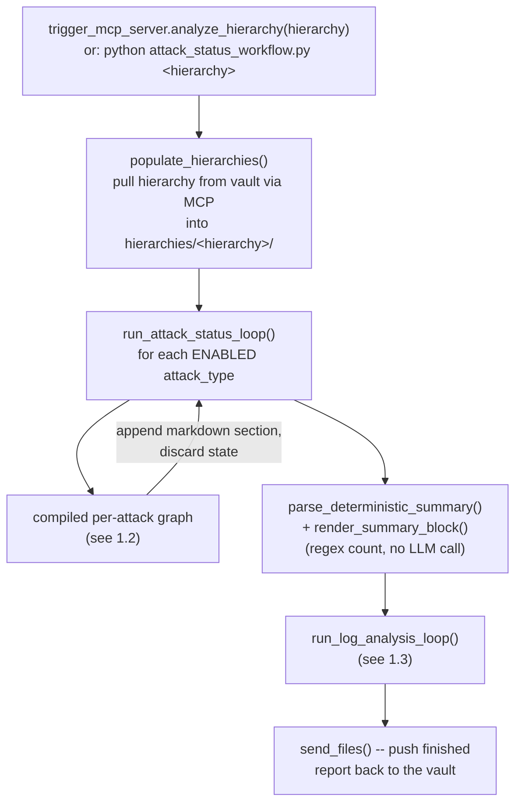
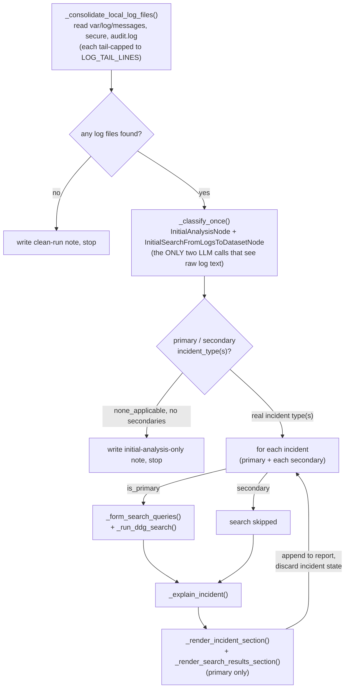

# Cybersecurity Log Analysis Agent — Technical Documentation

This document is the technical reference for the LangGraph-based analysis
pipeline: its architecture, how to install and run it, what each moving
part is for, and — attack type by attack type — exactly what each step of
the pipeline checks and which code does it. For the high-level two-machine
split (vault vs. analysis) and day-to-day setup, see [README.md](README.md);
this document goes one level deeper into the analysis pipeline itself.

---

## 1. Architecture

### 1.1 Top-level flow

One run processes one hierarchy path (e.g. `5/101/1/4/1`) end to end:
pull that hierarchy's files from the vault, run every enabled attack-type
check, run the secure/messages/audit.log catch-all, write one combined
markdown report, push it back to the vault. Entry point:
[`run_full_workflow`](analysis_system/attack_status_workflow.py:992).



Both the per-attack loop and the log-analysis loop are deliberately
**context-flat**: each iteration (one attack type, or one log-derived
incident) runs as a fresh, isolated invocation, appends its own markdown
section to the same report file on disk, and then everything about that
iteration — evidence text, search results, LLM output — goes out of scope.
Nothing carries forward into the next iteration except what's already been
written to the file. This is why processing 23 attack types plus several
log incidents doesn't grow the prompt size of any single LLM call as the
run progresses.

### 1.2 Per-attack-type graph

Every attack type — `ransomware`, `user_breach`, `config_drift`, all 23 —
runs through the exact same compiled LangGraph
([`build_attack_graph`](analysis_system/attack_status_workflow.py:862)),
just parameterized by that attack type's own corpus entry. This is the
one graph diagram that applies to all of them; §5 covers what's different
per attack type.


Six possible `final_status` outcomes come out of this graph:
`detected`, `discrepancy`, `not_detected`, `not_detected_unverifiable`,
`not_configured`, `cannot_determine` — see §5.1 for what each means and
which node sets it.

### 1.3 Log analysis flow

Runs once, after every attack type has been checked, reading
`var/log/{messages,secure,audit.log}` from the **same already-pulled local
copy** (no second vault fetch). Entry point:
[`run_log_analysis_loop`](analysis_system/lib/log_analysis_workflow.py:734).



### 1.4 Input files required

**From the vault, per hierarchy** (pulled locally by
[`populate_hierarchies`](analysis_system/lib/populate_hierarchies.py),
read by the attack-status graph):

| File (relative to the hierarchy root) | Used by |
|---|---|
| `Alert.xml` | The primary customer-facing status file — most attack types' tag(s) live here |
| `athinio/system/alertlog.xml` | Upstream of many `Alert.xml` tags; also the sole home of a few tags that never roll up (`lsattr_status`, `SV_Ransom_current_status`, `User_breach`/`suspicious_user_login`) |
| `athinio/system/secOpsOutput_91/94/96/105/112/128` and similar | Per-attack raw evidence/output files (rkhunter output, config-drift text scan, immutable-attribute alert lines, breach detail, unknown-binary detail, special-folder detail) |
| `athinio/system/aide_report.txt`, `athinio/system/rootkitscan.txt` | Supplementary evidence for `rootkit_malware` |
| `athinio/security/malwarefiles.xml`, `athinio/security/dataprotection.xml` | `clam_malware` / `dlp_data_exposure` counts |
| `var/neridio/banned_ip.xml` | `banned_ip_bruteforce` (presence check) |
| `athinio/system/user_emptypass_list.xml`, `athinio/system/zero_uid.xml`, `athinio/system/nouser_noowner.xml` | Weak-password / UID-0 / orphaned-file audits |
| `var/log/secure*`, `rationalVault/log/rationalclient.log*` | `user_breach`'s raw-log check, and `process_anomaly`'s evidence |
| `home/athinio/data/1cloudFiler/log/gateway.log*` | `gateway_unauthorized_breakin`'s raw-log check |
| `var/log/messages`, `var/log/secure`, `var/log/audit.log` | The log-analysis catch-all (§1.3), configurable via `LOG_FILE_PATHS` |

**Local to the analysis machine** (not per-hierarchy):

| File | Used by |
|---|---|
| `corpus_documents/attack_*.json` (23 files) + reference-file entries | Ingested into `corpus_db/` by [`ingest_corpus.py`](analysis_system/ingest_corpus.py) — every attack type's `status_file`/`status_tag`/`value_schema`/etc. comes from here, not a flat config file |
| `analysis_system/model/Modelfile` + `cybersecqwen.gguf` | Builds the local Ollama model (see §4.2) |
| `analysis_system/.env` | `MCP_SERVER_URL`, `LOG_FILE_PATHS`, `LOG_TAIL_LINES`, `CLASSIFICATION_VOTE_COUNT`, `ENABLED_ATTACK_TYPES`, `CORPUS_SERVER_URL` — see [.env.example](analysis_system/.env.example) |
| `hierarchy_system/.env` | `ANALYSIS_SERVER_URL`, optional `DATA_ROOT` |

### 1.5 Brief working

1. A trigger (either `trigger_mcp_server.py`'s `analyze_hierarchy` MCP
   tool, or running `attack_status_workflow.py` directly) names a
   hierarchy path.
2. That hierarchy's files are pulled from the vault machine over MCP into
   a local working copy.
3. Every **enabled** attack type (all 23 by default, or a subset via
   `ENABLED_ATTACK_TYPES`) is checked independently: read its live tag,
   decide detected/clean/unverifiable/not-configured, optionally verify a
   "clean" read against raw evidence, explain a "detected" or
   "discrepancy" result, render one markdown section, append it, discard.
4. A deterministic summary (a regex count over the appended sections'
   status markers) is appended.
5. The three canonical logs are read from the same local pull and
   classified once into a primary + secondary incident type(s); each gets
   its own isolated search-and-explain pass (primary only gets the web
   search) and its own appended section.
6. The finished report is pushed back to the vault next to the source
   files it was generated from.

---

## 2. Installation

Full detail (Rocky Linux 8 + Windows installers, tar packaging) is in
[README.md §8](README.md#8-packaging-and-installing). Summary:

### 2.1 Packaged install (recommended for a real deployment)

```bash
scripts/package_release.sh          # builds dist/analysis_system.tar.gz, dist/hierarchy_system.tar.gz
```

On each target machine:

```bash
tar -xzf analysis_system.tar.gz     # or hierarchy_system.tar.gz
cd analysis_system                  # or hierarchy_system
./install.sh                        # sudo ./install.sh on Rocky Linux 8
```

[`analysis_system/install.sh`](analysis_system/install.sh) detects the
platform (Rocky/RHEL via `dnf`, or Windows via `winget` under Git Bash),
installs Python 3.11 + a venv + `requirements.txt`, installs Ollama,
builds `cybersecqwen` from the bundled `model/Modelfile`, and ingests
`corpus_documents/*.json` into the vector store via a temporarily-started
`corpus_server.py`. [`hierarchy_system/install.sh`](hierarchy_system/install.sh)
does the same Python/venv/requirements setup only (no Ollama needed there).

### 2.2 Manual / development setup

```bash
cd analysis_system
python -m venv venv && source venv/bin/activate   # venv\Scripts\Activate.ps1 on Windows
pip install -r requirements.txt

ollama pull nomic-embed-text                       # embedding model for corpus_server.py
ollama create cybersecqwen -f model/Modelfile       # or: ollama pull <a model>, set MODEL_NAME

cp .env.example .env                                # then edit MCP_SERVER_URL etc.

python corpus_server.py &                           # start the corpus vector store (port 8003)
python ingest_corpus.py                              # one-shot: load corpus_documents/*.json into it
```

```bash
cd hierarchy_system
python -m venv venv && source venv/bin/activate
pip install -r requirements.txt
cp .env.example .env                                 # then edit ANALYSIS_SERVER_URL
```

---

## 3. Usage

**Bring the services up** (vault machine, then analysis machine):

```bash
# vault machine
python mcp_server.py                    # :8002 -- serves file reads/writes to the analysis machine

# analysis machine
python trigger_mcp_server.py            # :8001 -- accepts "analyze this hierarchy" requests
# (corpus_server.py from §2 must already be running, :8003)
```

Or, packaged: `hierarchy_system`'s `mcp_server.py` directly; `analysis_system`'s
[`start.sh`](analysis_system/start.sh) (starts `corpus_server.py` then
`trigger_mcp_server.py` in the background, PID files for both).

**Trigger an analysis** — three equivalent ways:

```bash
# 1. From the vault machine, over MCP (the normal path)
cd hierarchy_system
python trigger_mcp_client.py 5/101/1/4/1

# 2. Directly on the analysis machine, full pipeline (attack checks + log analysis, one report)
cd analysis_system
python attack_status_workflow.py 5/101/1/4/1
python attack_status_workflow.py 5/101/1/4/1 --vault-root /rationalVault/data --no-sync   # local testing, no MCP pull/push

# 3. Log analysis alone, against an already-pulled hierarchy (no vault pull of its own)
python -m lib.log_analysis_workflow 5/101/1/4/1
```

Output, per hierarchy, under `hierarchies/<hierarchy>/reports/`:
`attack_status_report_<timestamp>.md` — the combined report (attack-status
sections, then the log-analysis section, then the summary block).

---

## 4. Parts explained

### 4.1 Libraries

| Library | Used for |
|---|---|
| `langgraph` | `StateGraph`/`END` — the per-attack graph in [attack_status_workflow.py](analysis_system/attack_status_workflow.py) |
| `langchain-core` | `ChatPromptTemplate` — every LLM prompt in both workflows |
| `langchain-ollama` | `ChatOllama` (the LLM client, [lib/llm_client.py](analysis_system/lib/llm_client.py)) and `OllamaEmbeddings` ([corpus_server.py](analysis_system/corpus_server.py)) |
| `pydantic` | `BaseModel`/`Field` — every structured-output schema (`EvidenceVerificationResult`, `InitialAnalysisTemplate`, `ExplainerOutputTemplate`, etc.) |
| `ddgs` | `DDGS().text(...)` — DuckDuckGo search, used by `attack_info_node` and `_run_ddg_search` |
| `fastmcp` | `FastMCP`/`Client` — every MCP server (`mcp_server.py`, `trigger_mcp_server.py`, `corpus_server.py`) and client (`mcp_client.py`, `corpus_client.py`, `trigger_mcp_client.py`) |
| `chromadb` | `PersistentClient` — the attack-corpus vector store (`corpus_db/`) |
| `python-dotenv` | `load_dotenv()` — reads `.env` in every entry-point module |

### 4.2 The model

The pipeline uses one local Ollama chat model (default name `cybersecqwen`,
override via `MODEL_NAME`) plus one embedding model (`nomic-embed-text`,
fixed, override via `CORPUS_EMBED_MODEL`).

`cybersecqwen` is defined by [`analysis_system/model/Modelfile`](analysis_system/model/Modelfile):

```
FROM ./cybersecqwen.gguf
TEMPLATE "{{- range .Messages }}<|im_start|>{{ .Role }}
{{ .Content }}<|im_end|>
{{ end }}<|im_start|>assistant
"
PARAMETER stop <|im_start|>
PARAMETER stop <|im_end|>
PARAMETER temperature 0.2
PARAMETER top_p 0.9
PARAMETER num_ctx 8192
PARAMETER num_predict 4096
```

Low temperature (0.2) favors consistent, literal classification over
creative variation — this is a detection pipeline, not a chat assistant.
`num_ctx 8192` bounds the context window, which is why `LOG_TAIL_LINES`
(§1.4) matters for the log-analysis classification step specifically —
that's the one call still carrying full raw log text.

The `.gguf` weights are not committed to git (multi-gigabyte binary) — they're
produced from whatever Ollama already has built locally by
[`scripts/export_model.sh`](scripts/export_model.sh), which copies the real
weight blob out of Ollama's own blob store and rewrites the `Modelfile`'s
`FROM` line to point at the bundled relative file instead of a
machine-local path.

The single shared client instance lives in
[`lib/llm_client.py`](analysis_system/lib/llm_client.py):
`MODEL_REQUEST_TIMEOUT_SECONDS` (default 120s) bounds a single call so a
stuck/overloaded Ollama request fails with a clear exception instead of
hanging forever; `MODEL_NUM_GPU` (unset by default) can force pure-CPU
inference for A/B testing against GPU-assisted inference.

---

## 5. Attack-status checks — step by step, per attack type

### 5.1 The shared steps (apply to every attack type)

| Step | Function | What it does |
|---|---|---|
| 1. Resolve | [`resolve_attack_files_node`](analysis_system/attack_status_workflow.py:327) | Exact-id corpus lookup (`get_attack_entry`) for this attack type — pulls `status_file`, `status_tag`(s), `value_schema`, `verification_category`, `raw_evidence_files`, `writer_script`, `data_source_reliable` from `corpus_documents/attack_<type>.json` |
| 2. Reliability gate | [`route_after_resolve`](analysis_system/attack_status_workflow.py:413) | If `data_source_reliable` is `false` (only `secure_vault_ransomware`), skip straight to `cannot_determine` — reading a known-wrong source would just produce a confidently-wrong answer |
| 3. Read live status | [`read_live_status_node`](analysis_system/attack_status_workflow.py:356) | Reads the live tag(s)/file according to `value_schema.type` (see §5.2) via [`_read_xml_tags`](analysis_system/attack_status_workflow.py:226) / [`_read_text_file`](analysis_system/attack_status_workflow.py:254), and computes `triggered_tags` via [`_is_detected`](analysis_system/attack_status_workflow.py:269) |
| 4. Route | [`route_from_status_check`](analysis_system/attack_status_workflow.py:421) | Missing file → `not_configured`. Any tag triggered → `detected`. Otherwise branches on `verification_category` (§5.3) |
| 5a. Verify (evidence file) | [`verify_against_raw_evidence_node`](analysis_system/attack_status_workflow.py:460) | For `readable_report`/`diffable_snapshot_files` types: hands an LLM the live `raw_evidence_files` content (plus a labeled corpus reference example, if one exists) and asks whether it contradicts the "not detected" tag |
| 5b. Verify (raw logs) | [`verify_against_raw_logs_node`](analysis_system/attack_status_workflow.py:614) | For `check_raw_logs` types (`user_breach`, `gateway_unauthorized_breakin`): a **deterministic** regex/phrase match from [`RAW_LOG_CHECKERS`](analysis_system/attack_status_workflow.py:174) against the real rotation-aware log files in [`RAW_LOG_FILE_PATTERNS`](analysis_system/attack_status_workflow.py:104) — no LLM judgment call |
| 6. Explain | [`attack_info_node`](analysis_system/attack_status_workflow.py:701) | Only for `detected`/`discrepancy`: reads corroborating evidence fresh, runs 2 web searches, asks an LLM for a plain-language explanation + 3-5 recommended actions |
| 7. Render | [`render_markdown_section_node`](analysis_system/attack_status_workflow.py:775) | Builds the markdown section: status, [provenance chain](analysis_system/attack_status_workflow.py:756) (`writer_script` rendered as numbered hops), triggered tag(s), evidence, explanation |

### 5.2 `value_schema` types — how a raw tag value becomes detected/clean

Interpreted by [`_is_detected`](analysis_system/attack_status_workflow.py:269):

| `type` | Meaning | Used by |
|---|---|---|
| `binary_flag` | `live_value == "1"` | Most attack types (the default) |
| `count_greater_than_zero` | `int(live_value) > 0` | `clam_malware`, `dlp_data_exposure`, `weak_password_accounts`, `unauthorized_uid0_account`, `orphaned_files` — types where *any* nonzero count is inherently bad |
| `file_contains_pattern` | Regex search over the **whole raw file's text**, not one XML tag | `config_drift` (`Tampered`), `rootkit_malware` (`Warning:`) — attack types whose real output is a plain-text scan, not a tag |
| `file_non_empty` | File has any content at all | `banned_ip_bruteforce` — fail2ban's `banned_ip.xml` is checked for presence, not a value |
| `raw_value_needs_baseline_diff` | Always `False` here; verification is the real check | Not currently used by any attack type in this corpus, but supported |

### 5.3 `verification_category` — what happens when the tag says "clean"

| Category | Behavior | Used by |
|---|---|---|
| `readable_report` / `diffable_snapshot_files` | LLM verification against `raw_evidence_files` (§5.1 step 5a) | `immutable_attribute_drift`, `special_folder_monitoring`, `unknown_binary_detection` |
| `check_raw_logs` | Deterministic regex/phrase match (§5.1 step 5b) | `user_breach`, `gateway_unauthorized_breakin` |
| `requires_live_recompute` | No verification attempted — the real trigger is inside a compiled binary or needs a dynamically-named file this workflow can't locate; reported as `not_detected_unverifiable` | `ransomware`, `process_anomaly`, `gateway_breach_activity`, `gateway_ransomware_filesystem`, `gateway_ransomware_backup` |
| `opaque_binary_only` | Same as above — no raw evidence confirmed to exist at all | The remaining ~14 types (all the `count_greater_than_zero` types, `honeypot`, `secure_vault_ransomware`, `security_config`, `unauthorized_ddl`, `log_disable`, `banned_ip_bruteforce`) |

### 5.4 Per-attack-type reference

Sourced from `corpus_documents/attack_*.json`. `Multi-tag` means
`status_tags` (plural) is set — detection triggers on *any* of the listed
tags, computed once in `read_live_status_node`, not re-derived per tag.

| Attack type | Status file | Tag(s) | Schema | Verification | Notes |
|---|---|---|---|---|---|
| `ransomware` | `Alert.xml` | `Ransom`, `bin`, `lib`, `honeypot`, `Process` (multi-tag) | binary_flag | requires_live_recompute | Any 1 of 5 = detected — deliberately stricter than the product's own internal 2-of-4 combined-score threshold |
| `process_anomaly` | `Alert.xml` | `Process` | binary_flag | requires_live_recompute | Real threshold: current process count > 1.5x a 7-day running average (not a fixed "~50") |
| `rootkit_malware` | `athinio/system/secOpsOutput_91` | N/A — text scan for `Warning:` | file_contains_pattern | opaque_binary_only | rkhunter's own `--report-warnings-only` output; sets no XML tag anywhere |
| `unknown_binary_detection` | `Alert.xml` | `unknown_binary` | binary_flag | readable_report | Split out of `rootkit_malware`; `/proc/$pid/exe` enumeration against a 2-week learning-period baseline |
| `config_drift` | `athinio/system/secOpsOutput_94` | N/A — text scan for `Tampered` | file_contains_pattern | opaque_binary_only | 24h grace window on new changes, 24h self-clearing auto-expiry |
| `security_config` | `Alert.xml` | `security_config` | binary_flag | opaque_binary_only | No confirmed writer script in the bundle |
| `user_breach` | `athinio/system/alertlog.xml` | `User_breach`, `suspicious_user_login` (multi-tag) | binary_flag | check_raw_logs | Real 2-stage detector (14-day baseline + 30-min failed-attempt escalation); the raw-log check here is a simpler approximate heuristic |
| `gateway_unauthorized_breakin` | `Alert.xml` | `break-in` | binary_flag | check_raw_logs | Deterministic `"Break-in Attempt"` phrase match against rotated `gateway.log*` |
| `gateway_breach_activity` | `Alert.xml` | `breachval` | binary_flag | requires_live_recompute | 7-day per-worker baseline, alerts at >=2x that baseline |
| `gateway_ransomware_filesystem` | `Alert.xml` | `amsrans` | binary_flag | requires_live_recompute | `oneCloudFilerx`: >500 files changed within 1 hour |
| `gateway_ransomware_backup` | `Alert.xml` | `tier_ran` | binary_flag | requires_live_recompute | Same class of check, scoped to the backup/tiered-storage path only |
| `honeypot` | `Alert.xml` | `honeypot` | binary_flag | opaque_binary_only | Decoy-directory content diff |
| `special_folder_monitoring` | `Alert.xml` | `special_files_honeypot` | binary_flag | readable_report | Per-admin-configured-folder honeypot/immutability/activity checks |
| `immutable_attribute_drift` | `athinio/system/alertlog.xml` | `lsattr_status` | binary_flag | readable_report | `container`-named entries under `/home/nas/vdc0/` missing `chattr +i`, threshold 5+; does not roll up to `Alert.xml` |
| `secure_vault_ransomware` | `athinio/system/alertlog.xml` | `SV_Ransom_current_status` | binary_flag | opaque_binary_only | `data_source_reliable: false` — the documented writer script doesn't actually contain this logic; always `cannot_determine` |
| `clam_malware` | `athinio/security/malwarefiles.xml` | `nooffile` | count_greater_than_zero | opaque_binary_only | Per-file ClamAV scan markers, aggregated by a compiled binary |
| `dlp_data_exposure` | `athinio/security/dataprotection.xml` | `nooffile` | count_greater_than_zero | opaque_binary_only | Same pattern as `clam_malware`; the underlying XML-write code is confirmed commented out in the deployed scanner, so a clean 0 may reflect a broken pipeline rather than "no findings" |
| `banned_ip_bruteforce` | `var/neridio/banned_ip.xml` | N/A — file-presence check | file_non_empty | opaque_binary_only | fail2ban's own ban list |
| `weak_password_accounts` | `athinio/system/user_emptypass_list.xml` | `NoOfAccounts` | count_greater_than_zero | opaque_binary_only | `/etc/shadow` empty-password scan |
| `unauthorized_uid0_account` | `athinio/system/zero_uid.xml` | `NoOfExtraAccounts` | count_greater_than_zero | opaque_binary_only | `/etc/passwd` UID-0 scan; a confirmed real product bug writes the clean-state result to `weak_password_accounts`'s file instead of this one |
| `orphaned_files` | `athinio/system/nouser_noowner.xml` | `NoOfFiles` | count_greater_than_zero | opaque_binary_only | `find -nouser -o -nogroup` |
| `unauthorized_ddl` | `Alert.xml` | `drop_table`, `create_table`, `alter_table`, `truncate_table` (multi-tag) | binary_flag | opaque_binary_only | No confirmed writer script in the bundle |
| `log_disable` | `Alert.xml` | `log_disable` | binary_flag | opaque_binary_only | No confirmed writer script in the bundle |

For the full narrative behind any row above — real product bugs found,
mechanism corrections, confirmed-live examples — see that attack type's
own `corpus_documents/attack_<type>.json`, whose `explanation` field is
the authoritative source these table rows were summarized from.

---

## 6. Log analysis — step by step

Module: [`lib/log_analysis_workflow.py`](analysis_system/lib/log_analysis_workflow.py).
Unlike the attack-status checks (23 independent LangGraph invocations),
this is one classification pass followed by a plain Python loop over
however many incident types came out of it — no LangGraph here, but the
same invoke-fresh/append/discard discipline.

| Step | Function | What it does |
|---|---|---|
| 1. Read local logs | [`_consolidate_local_log_files`](analysis_system/lib/log_analysis_workflow.py:707) | Reads `var/log/messages`, `var/log/secure`, `var/log/audit.log` (configurable via `LOG_FILE_PATHS`) directly from the hierarchy directory the attack-status pull already populated — no separate vault fetch. Each file capped to its last `LOG_TAIL_LINES` lines |
| 2a. Initial analysis | [`InitialAnalysisNode`](analysis_system/lib/log_analysis_workflow.py:283) | First of two LLM calls that see raw log text — produces a title + 100-200 word initial analysis |
| 2b. Classify | [`InitialSearchFromLogsToDatasetNode`](analysis_system/lib/log_analysis_workflow.py:338) | Second and last call to see raw log text — picks a primary `incident_type` and any `secondary_incident_types` from the fixed [`ALLOWED_INCIDENT_TYPES`](analysis_system/lib/log_analysis_workflow.py:95) (12 types, scoped to what's detectable from these 3 logs). A rule-based hint embedded in the log text (from the deterministic attack-status checks) is treated as near-authoritative; without one, runs self-consistency voting `CLASSIFICATION_VOTE_COUNT` times (default 1, off) |
| 3. Discard raw text | [`_classify_once`](analysis_system/lib/log_analysis_workflow.py:511) | Wraps steps 2a/2b; nothing past this point ever sees the raw logs again — only `title`/`content`/incident type(s) |
| 4. Search (primary only) | [`_form_search_queries`](analysis_system/lib/log_analysis_workflow.py:531) + [`_run_ddg_search`](analysis_system/lib/log_analysis_workflow.py:565) | 5 queries — 2 plainly describing the incident/technique, 3 targeted at named threat-intel sources (MITRE ATT&CK, CISA, NVD/CVE, via `site:` operators) — then run through DuckDuckGo. **Secondary incidents skip this step entirely** |
| 5. Explain | [`_explain_incident`](analysis_system/lib/log_analysis_workflow.py:584) | One incident at a time (primary and secondary get identical treatment here): calibrated `threat_level` (low/medium/high/critical), a 300-500 word narrative grounded in title/content/search results, recommended actions |
| 6. Render | [`_render_incident_section`](analysis_system/lib/log_analysis_workflow.py:682) + [`_render_search_results_section`](analysis_system/lib/log_analysis_workflow.py:655) | One markdown section per incident; the search-results block (grouped by query, real DDG results) only appears for the primary incident, since that's the only one with search results to show |
| 7. Loop driver | [`run_log_analysis_loop`](analysis_system/lib/log_analysis_workflow.py:734) | Orchestrates steps 1-6, appends each section to the shared report, short-circuits to a plain clean-run note if no log files were found or nothing applicable was classified |

**Why secondary incidents skip search**: every secondary finding was
paying the same query-generation + 5x-DuckDuckGo-search cost as the
primary incident, for comparatively low value — these are already
lower-priority findings by definition. Secondary incidents are still
explained (step 5) from the classification alone, just without the web
search grounding.
