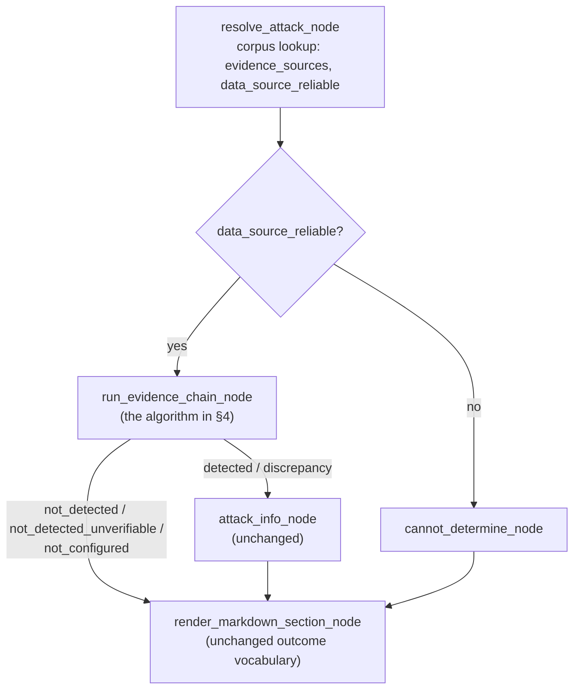

# Design: A Generic, Data-Driven Evidence Engine for Attack-Status Checks

**Status: proposal — not implemented.** This document describes a redesign
of `attack_status_workflow.py`'s core graph so that adding a new attack
type of any of the 12 evidence shapes in
[ADDING_ATTACK_TYPES.md](ADDING_ATTACK_TYPES.md) never requires a Python
change — only a `corpus_documents/attack_<type>.json` entry. Written for
review before touching the working pipeline.

---

## 1. Motivation

Today, `readable_report` (an LLM judges a file's raw text against a "not
detected" claim) and `check_raw_logs` (a hardcoded regex/phrase function
judges a log) are two separate, hardcoded code paths for what is
conceptually the same operation: *interpret this evidence source using
known meanings, and fall back to judgment for anything the known meanings
don't cover.* Concretely, this shows up as three real problems:

1. **`check_raw_logs` needs code, every time.** Adding a log-verified
   attack type means editing `RAW_LOG_FILE_PATTERNS`, writing a matcher
   function, and registering it in `RAW_LOG_CHECKERS` — three edits to
   `attack_status_workflow.py` for what is otherwise a pure-data addition
   everywhere else in this corpus.
2. **Correlation logic (`user_breach`'s "same IP in a Failed line, then an
   Accepted line") is bespoke Python** where a single regex with a
   backreference (`(?P<ip>...)  ...  (?P=ip)`) already expresses the same
   check declaratively — confirmed workable in this session's design
   discussion, just not built.
3. **The corpus's semantic-query capability (`query_corpus`,
   `nomic-embed-text`) is fully built and unused** — nothing in the live
   pipeline calls it (see DOCUMENTATION.md §5.5). A fallback path for
   "this evidence doesn't match any known pattern, but is it similar to a
   known example?" is a natural, currently-idle use for it.

The graph is also more complex than the actual decision space warrants —
12 nodes (`resolve`, `read_status`, `detected`, `unverifiable`,
`cannot_determine`, `not_configured`, `verify`, `verify_raw_logs`,
`not_detected_clean`, `discrepancy`, `attack_info`, `render`) to express
what is really: walk a list of evidence sources, stop at the first
conclusive `detected`, otherwise report clean-if-fully-checked.

## 2. Goals / non-goals

**Goals:**
- Every attack type — regardless of which of the 12 evidence shapes it
  is — is addable with **zero Python changes**, given a corpus JSON entry.
- Unify `readable_report` and `check_raw_logs` into one evidence-source
  interpretation mechanism, applied uniformly to XML tags, XML/text
  output files, and rotating logs alike.
- Preserve every existing report outcome (`detected`, `discrepancy`,
  `not_detected`, `not_detected_unverifiable`, `not_configured`,
  `cannot_determine`) and their current meanings — this is a mechanism
  change, not a report-format change.
- Deterministic pattern matching stays the first, free, fast path;
  LLM/semantic judgment is a fallback, not the default, same as today's
  design philosophy (§5.1 already treats `check_raw_logs` as strictly
  preferable to LLM judgment where a confirmed pattern exists).

**Non-goals (out of scope for this document):**
- Applying the same "structured event typing" idea to
  `lib/log_analysis_workflow.py`'s classification step (raised in this
  session's design discussion as a related but separate follow-on — worth
  its own design doc later, not bundled here).
- Modeling any attack type's *real*, fully stateful mechanism (e.g.
  `user_breach`'s actual 14-day baseline + 30-minute escalation window) —
  today's approximations stay approximations; this redesign changes *how*
  a pattern is declared and matched, not what's realistically checkable
  from a stateless snapshot.

## 3. New corpus schema: `evidence_sources`

Replaces `status_file` + `status_tag`/`status_tags` + `value_schema` +
`verification_category` + `raw_evidence_files` with one ordered list.
Order matters — sources are walked in sequence, and the position of a
source changes what a `detected` verdict there *means* (see §4).

```json
"evidence_sources": [
  {
    "file": "Alert.xml",
    "read_as": "xml_tag",
    "tag": "example_attack_1",
    "known_patterns": [
      {"value": "1", "detected": true, "meaning": "Tag is set -- indicator active."},
      {"value": "0", "detected": false, "meaning": "Tag clear -- no indicator."}
    ]
  },
  {
    "file": "athinio/system/example_1_output.xml",
    "read_as": "text",
    "known_patterns": [
      {"pattern": "Tampered", "detected": true, "meaning": "Drift detected for the preceding item."},
      {"pattern": "None", "detected": false, "meaning": "No drift for this item."}
    ],
    "examples": [
      {"label": "clean", "content": "rclient_config.xml\nNone", "note": "..."},
      {"label": "detected", "content": "rclient_config.xml\nTampered", "note": "..."}
    ],
    "judgment_allowed": true
  },
  {
    "file": "var/log/osstatus.log",
    "read_as": "text",
    "rotates": true,
    "known_patterns": [
      {
        "pattern": "Failed password.*?from (?P<ip>\\d{1,3}(?:\\.\\d{1,3}){3}).*?Accepted password for \\S+ from (?P=ip)",
        "flags": ["DOTALL"],
        "detected": true,
        "meaning": "Failed-then-accepted-password from the same source address."
      }
    ]
  }
]
```

Field reference:

| Field | Meaning |
|---|---|
| `file` | Path relative to the hierarchy root, same convention as today's `status_file`/`raw_evidence_files` |
| `read_as` | `"xml_tag"` (read one named tag's text) or `"text"` (read the whole file/log as text) |
| `tag` | Required when `read_as: "xml_tag"` |
| `rotates` | When true, `file` is treated as a glob prefix (`file*`) — same mechanism `RAW_LOG_FILE_PATTERNS` uses today for rotating logs |
| `known_patterns` | Ordered list of `{value or pattern, detected, meaning}` — deterministic, free, tried first. `value` for exact tag-equality checks; `pattern` for regex (supports named groups + backreferences for correlation, e.g. `user_breach`'s case) |
| `examples` | Labeled illustrative content (same shape as today's `raw_content_examples`) — used to ground an LLM judgment call when no `known_patterns` entry matches |
| `judgment_allowed` | If true and nothing in `known_patterns` matched, fall back to an LLM judgment (today's `verify_against_raw_evidence_node` prompt) grounded by `examples`. If false/absent, an unmatched read is `inconclusive`, not escalated to an LLM — this is the data-driven equivalent of today's `opaque_binary_only` (no evidence, don't guess) |

Multi-tag attack types (`ransomware`'s `Ransom`/`bin`/`lib`/`honeypot`/`Process`,
`unauthorized_ddl`'s 4 sibling tags) become multiple `xml_tag` sources
against the same file, each independently contributing a `detected`
verdict — the "any one of N" semantics fall out naturally from "first
source in the list to say `detected` wins" (§4), no special-casing needed.

`data_source_reliable: false` (today's `secure_vault_ransomware` case)
stays a top-level corpus field, unrelated to `evidence_sources` — it still
short-circuits to `cannot_determine` before anything is read.

## 4. The generic evaluation algorithm

One function, replacing `read_live_status_node` +
`route_from_status_check` + `verify_against_raw_evidence_node` +
`verify_against_raw_logs_node` + `route_after_verification`:

```
for each evidence_source in evidence_sources (in order):
    read the file (glob if rotates=true)
    if file missing:
        if this is the FIRST source -> final_status = not_configured, stop
        else -> mark this source "inconclusive (file not found)", continue
        continue

    try each known_pattern in order:
        if it matches -> this source's verdict = pattern.detected, meaning = pattern.meaning
        break on first match

    if no known_pattern matched and judgment_allowed and examples exist:
        verdict = LLM judgment (today's verify_against_raw_evidence_node prompt),
                  grounded by `examples`
    elif no known_pattern matched:
        verdict = inconclusive

    if verdict == detected:
        final_status = "detected" if this is the FIRST source else "discrepancy"
        stop, record which source triggered it
    # else (not_detected or inconclusive): continue to the next source

# reached the end of the list with no detected verdict:
if every source was successfully read and conclusive (not_detected):
    final_status = "not_detected"                    # verified across every configured source
elif the first source was readable and not_detected, but later sources
     were inconclusive or absent:
    final_status = "not_detected_unverifiable"        # same meaning as today
```

This preserves every current outcome exactly:
- **`detected`** — the *first* source in the list (the old "primary tag")
  found it.
- **`discrepancy`** — the first source said clean, but a *later* source
  (the old "verification evidence") found it anyway. This is the same
  concept as today's discrepancy path, just reached via "not the first
  source" instead of a separate verify-node branch.
- **`not_detected`** — every declared source was read and agreed clean.
  This is *strictly more thorough* than today for `readable_report`/
  `check_raw_logs` types (which only ever check one verification source)
  when an attack type declares more than 2 sources — not a behavior
  change for any of the current 23, since none currently declare more
  than 2.
- **`not_detected_unverifiable`** — first source clean, nothing further
  configured or nothing further was checkable. Same meaning as
  `opaque_binary_only`/`requires_live_recompute` today.
- **`not_configured`** / **`cannot_determine`** — unchanged.

## 5. Graph changes

`build_attack_graph()` shrinks from 12 nodes to 4:



`render_markdown_section_node` needs only small changes: it currently
reads `state["writer_script"]`/`state["status_tag"]` for the provenance
chain and triggered-tag display — under the new schema these come from
whichever `evidence_source` actually triggered (or, for a clean result,
from the full list of sources checked). The six-outcome rendering
branches themselves are unchanged.

## 6. Migration plan for the existing 23 attack types

All the information needed already exists in each corpus entry's current
`status_file`/`status_tag`(s)/`value_schema`/`verification_category`/
`raw_evidence_files` fields — this is a mechanical, automatable
conversion, not a re-authoring effort:

| Old shape | New `evidence_sources` |
|---|---|
| `status_file` + `status_tag` + `binary_flag`, `verification_category: opaque_binary_only` | One `xml_tag` source, `known_patterns: [{"value":"1","detected":true}, {"value":"0","detected":false}]`, no `judgment_allowed` |
| ...+ `status_tags` (plural, multi-tag) | One `xml_tag` source per tag, same file, in any order |
| ...+ `readable_report`, `raw_evidence_files: [...]` | Primary `xml_tag` source, then one `text` source per `raw_evidence_files` entry with `judgment_allowed: true` and `examples` carried over from `raw_content_examples` |
| ...+ `check_raw_logs` | Primary `xml_tag` (or `alertlog.xml` tag) source, then one `text` source per `RAW_LOG_FILE_PATTERNS` entry with `rotates: true` and a `known_patterns` regex reconstructed from the existing `RAW_LOG_CHECKERS` function's logic |
| `value_schema: file_contains_pattern`, no tag | One `text` source directly on `status_file`, `known_patterns: [{"pattern": detected_regex, "detected": true}]` |
| `value_schema: file_non_empty` | One `text` source, `known_patterns` keyed on "file has any content" rather than a specific pattern (needs a small schema allowance — `presence_only: true` — for `banned_ip_bruteforce`'s exact shape) |

Proposed: a one-time **migration script** (`scripts/migrate_corpus_schema.py`)
that reads each `corpus_documents/attack_*.json`, applies the table
above, and writes the new `evidence_sources`-shaped file — reviewed by
hand afterward (especially the `check_raw_logs` → regex reconstructions,
since `user_breach`'s and `gateway_unauthorized_breakin`'s current
matcher functions need to become faithful regex equivalents, not
approximations) rather than hand-converting 23 files individually.

## 7. Rollout phases

1. **Build the engine.** `run_evidence_chain_node`, the `known_patterns`
   matcher (exact value / regex, with named-group backreference support),
   the `judgment_allowed` LLM fallback (reusing today's
   `verify_against_raw_evidence_node` prompt logic), and the new
   `AttackState`/corpus-read shape. Validate against a handful of real
   attack types spanning every current category (`rootkit_malware`
   [file_contains_pattern, no tag], `user_breach` [check_raw_logs +
   correlation], `unknown_binary_detection` [readable_report],
   `ransomware` [multi-tag]) against a real or fixture hierarchy, diffing
   old-graph vs. new-graph report output for behavioral parity.
2. **Migrate the corpus.** Run the migration script across all 23
   `corpus_documents/attack_*.json`, hand-review the `check_raw_logs`
   conversions specifically, re-ingest, re-validate parity for all 23.
3. **Cut over.** Swap `build_attack_graph()` to the new 4-node graph,
   delete `RAW_LOG_CHECKERS`, `RAW_LOG_FILE_PATTERNS`, the old
   `verify_against_raw_evidence_node`/`verify_against_raw_logs_node`/
   routing functions, and the old `value_schema`/`verification_category`
   handling in `_is_detected`. Update `DOCUMENTATION.md` §5 and
   `ADDING_ATTACK_TYPES.md` to describe the new schema (§5's current
   12-shape table gets *simpler* under this design — most rows collapse
   to "one `xml_tag` source" or "one `xml_tag` + one `text` source with
   `rotates`", with genuinely zero code-change rows remaining at all).

## 8. Open questions before implementation

- **Explicit `correlate` construct, or backreference-regex only for v1?**
  A `{"correlate": ["pattern_a", "pattern_b"], "on_field": "ip"}` form
  would be easier for a non-regex-fluent person authoring a new corpus
  entry to write than a hand-built backreference regex, at the cost of a
  second code path in the matcher. Recommendation: ship backreference-only
  for v1 (covers every currently-known real case, including `user_breach`
  faithfully), add `correlate` later only if a real attack type needs
  cross-pattern correlation a single regex can't express.
- **`query_corpus` semantic pre-check before the LLM fallback, or defer?**
  Would reduce LLM calls further (only judge when semantically close to
  neither a known-clean nor known-detected example) but adds a second
  fallback tier to test. Recommendation: defer to a v2 — ship the direct
  pattern-then-LLM fallback first, since it already achieves the "zero
  code for new attack types" goal on its own.
- **Field naming**: `evidence_sources`/`known_patterns`/`examples` as
  proposed here, or keep closer to today's `raw_evidence_files`/
  `raw_content_examples` naming to minimize the vocabulary the corpus'
  existing entries need to learn? Since this is a structural schema
  change regardless (every entry needs touching), naming is a one-time
  choice with no compatibility cost either way — flagging for a decision,
  not a technical constraint.
- **Test coverage before cutover**: worth building a small fixture-based
  parity test (real or hand-built hierarchy fixtures for a representative
  attack type per category) that runs both the old and new graph and
  diffs `final_status`/rendered section, rather than relying on manual
  spot-checks across 23 entries during phase 2.
